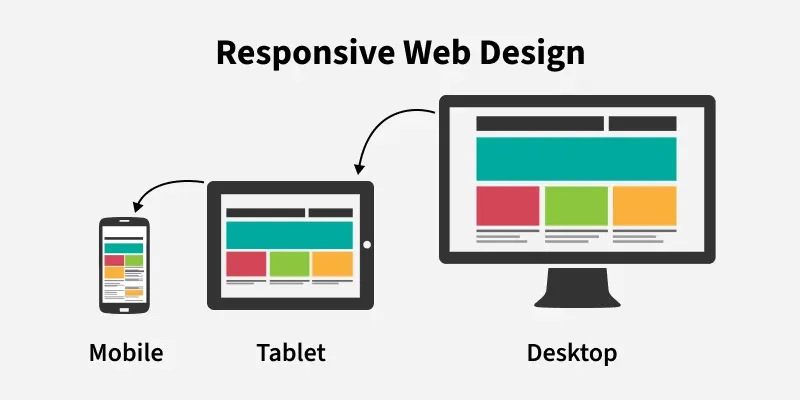

# Disseny Responsive amb CSS

## Què és el disseny responsive?

El **disseny responsive** (o *Responsive Web Design*) és una tècnica de desenvolupament web que permet que una pàgina s'adapti automàticament a diferents mides de pantalla.

Una mateixa pàgina web pot visualitzar-se en:

* 📱 Mòbils
* 📱 Tablets
* 💻 Portàtils
* 🖥️ Ordinadors de sobretaula
* 📺 Pantalles grans

L'objectiu és que el contingut sigui **fàcil de veure i utilitzar independentment del dispositiu**.



# El viewport

Perquè un document HTML s'adapti correctament als dispositius mòbils, és molt important definir el **viewport**.

Dins del `<head>` de l'HTML:

```html
<meta name="viewport" content="width=device-width, initial-scale=1.0">
```

Aquesta línia indica al navegador que:

* `width=device-width` → l'amplada de la pàgina ha de coincidir amb l'amplada del dispositiu.
* `initial-scale=1.0` → la pàgina comença amb una escala del 100%.

> **Important:** en una web responsive aquesta etiqueta hauria d'aparèixer sempre.

### Exemple d'HTML bàsic

```html
<!DOCTYPE html>
<html lang="ca">
<head>
    <meta charset="UTF-8">
    <meta name="viewport" content="width=device-width, initial-scale=1.0">

    <title>Web responsive</title>
</head>

<body>
    <h1>La meva web</h1>
</body>
</html>
```

# Media Queries

Les **media queries** són una funcionalitat de CSS que permet aplicar regles diferents segons les característiques del dispositiu o la pantalla. 

## Sintaxi

```css
@media screen and (max-width: 768px) {
    /* Regles per a pantalles de més de 768px */
}
```

### Exemple pràctic

```css
/* Estils per a pantalles petites */
@media screen and (max-width: 768px) {
    body {
        font-size: 14px;
    }
}

/* Estils per a pantalles grans */
@media screen and (min-width: 769px) {
    body {
        font-size: 18px;
    }
}
```

A partir d'una amplada de pantalla de 769 píxels o superiors, el text serà més gran.

