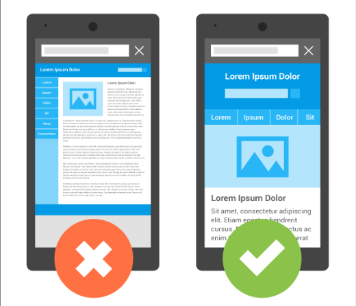
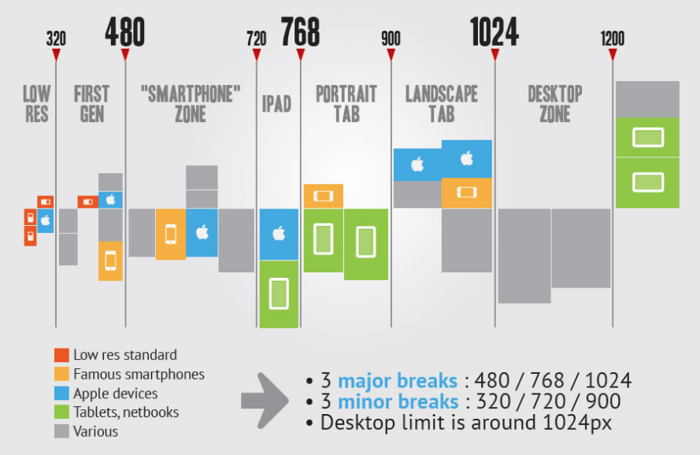

# Disseny Responsive amb CSS

## Què és el disseny responsive?

El **disseny responsive** (o *Responsive Web Design*) és una tècnica de desenvolupament web que permet que una pàgina s'adapti automàticament a diferents mides de pantalla.

Una mateixa pàgina web pot visualitzar-se en:

* 📱 Mòbils
* 📱 Tablets
* 💻 Portàtils
* 🖥️ Ordinadors de sobretaula
* 📺 Pantalles grans

L'objectiu és que el contingut sigui **fàcil de veure i utilitzar independentment del dispositiu**.


## El problema de les mides fixes

Considerem aquest CSS:

```css
.container {
    width: 1200px;
}
```

En un monitor gran pot funcionar correctament.

Però si obrim la pàgina en un dispositiu de **390 px d'amplada**, el contingut no hi cap.

El navegador haurà de mostrar una barra de desplaçament horitzontal.

Per evitar-ho, en un disseny responsive intentarem **evitar les amplades fixes** quan no siguin necessàries.

## Configurar el viewport

Perquè un document HTML s'adapti correctament als dispositius mòbils, és molt important definir el **viewport**.

Aquesta etiqueta s'ha de posar dins del `<head>` de l'HTML:

```html
<head>
    <meta name="viewport" content="width=device-width, initial-scale=1.0">
</head>
```

Aquesta línia indica al navegador que:

* `width=device-width` → l'amplada de la pàgina ha de coincidir amb l'amplada del dispositiu.
* `initial-scale=1.0` → Indica que la pàgina s'ha de mostrar inicialment sense aplicar zoom (escala del 100%).

> **Important:** en una web responsive aquesta etiqueta s'ha de posar sempre.



* Sense el **viewport** definit, el navegador mòbil calcula l’amplada del lloc i l'escala la pàgina a la de la pantalla, de manera que el contingut és difícil de llegir. 
  
* Amb el **viewport** definit fa que l’amplada del lloc coincideixi amb l'amplada del dispositiu - el navegador mòbil no escala la pàgina i el contingut és llegible.


## Media Queries

Les **media queries** són una funcionalitat de CSS que permet aplicar CSS diferent segons les característiques del dispositiu o la pantalla. 

La més habitual és comprovar-ne l'amplada.

**Exemple:**

```css
@media screen and (max-width: 768px) {
    /* Regles per a pantalles de menys de 768px */
    body {
        background-color: lightgray;
    }

}
```

---
### Exemple pràctic

```css
/* Estils per a pantalles petites */
@media screen and (max-width: 768px) {
    body {
        font-size: 14px;
    }
}

/* Estils per a pantalles grans */
@media screen and (min-width: 769px) {
    body {
        font-size: 18px;
    }
}
```

A partir d'una amplada de pantalla de 769 píxels o superiors, el text serà més gran.


---


## Breakpoints

> Els punts on modifiquem el disseny s'anomenen **breakpoints**.

**Breakpoints habituals**


Per exemple:


### Estratègia Desktop First

* Una possible manera de treballar consisteix a dissenyar primer la versió d'ordinador.

**Primer** es creen les regles CSS per als navegadors **d'ordinadors** i després s'afegeixen Media Queries per definir els estils en navegadors de tablets i mòbils.


```css
/* Regles CSS per a Ordinador */
* {
    box-sizing: border-box;
}


/* Tauleta */
@media (max-width: 768px) {


}

/* Mòbil */
@media (max-width: 480px) {

}
```


### Estratègia Mobile First

> Actualment és molt habitual utilitzar l'estratègia **Mobile First**.

* **Primer** programem la versió més senzilla: el mòbil.

* **Després** ampliem el disseny a mesura que tenim més espai.

Exemple:

```css
/* Regles CSS per a Mòbil */
* {
    box-sizing: border-box;
}


/* Tauleta */
@media (min-width: 481px) {


}

/* Ordinador */
@media (min-width: 769px) {


}
```

Aquest enfocament acostuma a ser una bona opció perquè obliga a començar pel contingut essencial.


## Com provar una web responsive

Els navegadors actuals permeten **simular diferents dispositius**.

A Chrome o Edge podem obrir les eines de desenvolupament amb **F12**.


i activar **Toggle device toolbar**


També podem utilitzar 
**Ctrl + Shift + M**


Podrem seleccionar dispositius com:

- iPhone;
- Pixel;
- iPad;
- Galaxy;
- dispositius personalitzats.

Però no ens hem de limitar als dispositius predefinits.

És molt útil **arrossegar manualment l'amplada de la finestra**.

Això permet detectar exactament en quin punt es trenca el disseny.


# Exercici proposat

Crea una pàgina web d'una botiga d'informàtica amb:

- capçalera;
- logotip;
- menú de navegació;
- secció de productes;
- un mínim de 6 productes;
- imatge, nom, descripció i preu de cada producte;
- peu de pàgina.

La web haurà de tenir el següent comportament:

### Mòbil

```text
1 producte per fila
```

### Tauleta

```text
2 productes per fila
```

### Ordinador

```text
3 productes per fila
```

Condicions:

- Utilitza una estratègia **Mobile First**.
- No utilitzis amplades fixes per al contenidor principal.
- Les imatges han de ser responsive.
- Utilitza **CSS Grid** per als productes.
- Utilitza almenys dues `media queries`.
- La pàgina no pot tenir scroll horitzontal en cap resolució.
- Comprova el resultat amb les eines de desenvolupador del navegador.


