# CSS

## Introducció

> Els **Cascading Style Sheets (CSS)** són la forma de donar format a les dades d'un document.

Les possibilitats de format de CSS es poden dividir en 3 àrees:

* **Fonts i colors**: format del contingut
* **Distàncies i marcs**
* **Layout**: modificar la posició dels elements de la pàgina web

Abans que es generalitzés l'ús dels **CSS**, s'utilitzaven etiquetes especials per modificar l'aspecte dels elements d'una pàgina.

```markup
<body>
  <h1><font color="red" face="Arial" size="5">Titular de la pàgina</font></h1>
  <p><font color="gray" face="Verdana" size="2">Un paràgraf de text.</font></p>
  <p><font color="gray" face="Verdana" size="2">Un altre paràgraf de text.</font></p>
</body>
```

En els sites amb moltes pàgines, els **canvis de formats** de eren **molt laboriosos**.

* Calia anar element per element, a cada pàgina!!

### Avantatges del CSS

* Permet **separar el contingut de la seva presentació**.
* Permet **definir les regles de presentació** d'un document a partir de les etiquetes que conté.
* Permet aplicar les regles de presentació a **múltiples pàgines**.

### Versions

* **CSS 1** (1996)
* **CSS 2** (1998)&#x20;
* **CSS 2.1** es finalitza al 2011.
* **CSS 3** (versió actual)&#x20;


## Utilització dels CSS

Per **aplicar fulles d'estil CSS a HTML** es pot fer a través de tres formes:

* CSS **integrades** en un element HTML5
  * Amb l'atribut `style`  en etiquetes html.
* CSS **internes** al document
  * Amb una etiqueta `<style>`
* CSS **externes** al document&#x20;
  * Amb un arxiu extern .css i utilitzant l'etiqueta `<link>`

## CSS integrades en una etiqueta html

Permet especificar regles CSS d'una etiqueta HTML.

> És la forma **menys recomanada** de fer-ho ja que complica la compartició.

Es col·loca dins d'una etiqueta de HTML amb l'atribut `style`


**Exemple 1: Estil definit per una etiqueta**

```markup
<p style="color:#990000">
   Això és un paràgraf de color vermell
</p> 
<p style="color:#000099">
   Això és un paràgraf de color blau
</p>
```

El resultat serà:


**Exemple 2: Estil definit en petites parts d'una pàgina**

Mitjançant l'etiqueta `<span>` i l'atribut `style`.

```markup
<p>
   Això és un paràgraf que té diverses paraules  
   <SPAN style="color:green">de color verd</SPAN>. fàcil, no?
</p>
```

El resultat serà:


**Exemple 3: Estil definit en una part de la pàgina**

Mitjançant l'etiqueta `<div>` i l'atribut `style`.

```markup
<div style="color:#000099; font-weight:bold">
    <h3>Aquestes etiquetes van en <i>blau i negreta</i></h3>
    <p>
        Seguim dins del DIV, encara funcionen els estils
    </p> 
</div>
```

El resultat serà:


## CSS internes al document

* Permet especificar regles **CSS dins del document** HTML.
* Estil definit s'aplicarà a tota la pàgina HTML.
* **No** és la forma més recomanada de fer-ho ja que complica la compartició.
* Es defineixen dintre del `<head>`.
* S'utilitza l'etiqueta `<style>` i `</style>`

```markup
<html>
<head>
   <title>Exemple d'estils en una pàgina</title>
   <style>
       h1 {
          text-decoration: underline;
          text-align:center
        }
        p {
          font-Family:arial,verdana; 
          color: white; 
          background-color: black
        }
        body {
          color:black;
          background-color: #cccccc; 
          text-indent:1cm
        }
    </style>
</head> 
<body>
   <h1>Pàgina amb estils</h1>
   Benvinguts
   <p>n-èssim exemple sense massa importància en el contingut</p>
</body>
</html>
```

**El resultat serà:**


## CSS Externes

* Estil definit per **tot un lloc web**.
* Es crea un **arxiu a part** on guardem tota la informació d'estils de la pàgina.

> **És el millor sistema**. És reaprofitable per totes les pàgines del lloc web.

**Exemple de document CSS:**

```css
p  {
 font-size : 12pt;
 font-family : arial,helvetica;
 font-weight : normal;
} 
h1  {
 font-size : 36pt;
 font-family : verdana, arial;
 text-decoration : underline;
 text-align : center;
 background-color : Teal;
}
td  {
 font-size : 10pt;
 font-family : verdana, arial;
 text-align : center;
 background-color : 666666;
}
body  {
 background-color : #006600;
 font-family : arial;
 color : White;
}
```

### Associar full d'estils CSS a una pàgina HTML

Un cop tenim creat l'arxiu CSS, l'hem d'**enllaçar** amb les diferents pàgines que tenim, mitjançant l'etiqueta `<link>`

```markup
<head>
   <link rel="stylesheet" href="estil.css">
</head>
```

* `rel="stylesheet"`: indica que l'enllaç és una fulla d'estils.
* `href="estil.css"`: indica el nom del fitxer CSS dels estils.

## Regles CSS

> Les **regles CSS** defineixen de quina forma es representaran les diferents etiquetes HTML de la pàgina.


Si volem especificar **més d'una propietat** en una regla CSS:

* Es posen una darrere l'altra dins dels claudàtors.
* Separades amb un punt i coma ( `;` )

**Exemple:**

```css
h1 {       
    font-size: 10pt; 
    text-decoration: underline; 
    color: black; 
    font-family:arial;
    background-color:#00FF00; 
}
```

## Regles d'ús

### Cascada

> La "C" de CSS vol dir "_**Cascading**_".

És possible tenir varies definicions d'estil (externes, internes i integrades en etiqueta).

En cas que hi hagi un **conflicte entre els estils** definits s'aplica la següent prioritat:

**De menor a major prioritat:**

* 1er. Estils predeterminats del **navegador**.
* 2on. Fulles d'estil **externes** (en un arxiu CSS separat).
* 3er. Fulles d'estil **internes** (en el `<head>`).
* 4rt. Estils **integrats** en etiquetes HTML.

**Per exemple:**

```markup
<html>
<head>
    <style>
        h1 {
            color: blue;
        }
    </style>
</head>
<body>
    <h1 style="color:red">Títol</h1>
</body>
</html>
```

**De quin color es veurà el text del títol, vermell o blau?**

#### Selectors repetits

Si **repetim una etiqueta en el mateix nivell** i s'hi repeteix alguna propietat, el darrer valor és el vàlid.

```css
h1 { 
    font-family:arial;
    color: blue;
}

h1 { color:red; }
```

El contingut de les etiquetes h1 es pintarà de color vermell perquè és la **última definició** que s'ha trobat

### Herència

> Els estils CSS s'hereden d'una etiqueta a un altre.

**Exemple:**

```css
body { font-family:arial;
       color:#FF0000;
       background-color:#00FF00; }

h2 { font-style: italic; }
```

Definim l'estil del `<body>` i per tant les etiquetes de dins tenen el mateix estil.

* `h2` a més de les característiques anteriors estarà en cursiva.

## Comentaris

> CSS permet incloure **comentaris** entre les seves regles.

* Els navegadors ignoraran aquests comentaris.
* S'indiquen mitjançant els caràcters `/*` i `*/`

**Exemple:**

```css
/* Això és un comentari en CSS */
```

> **Alerta!** El comentaris s'envien al navegador juntament amb la resta d'estils, per tant no es poden incloure dades confidencials.

## Propietats CSS

CSS defineix moltes **propietats** i a cada versió n'afegeixen més

Les propietats poden ser agrupades en quatre grans **grups**:

* Propietats de tipus de lletres
* Propietats de text
* Propietats de fons de pantalla
* Propietats de caixes

### Tipus de lletra

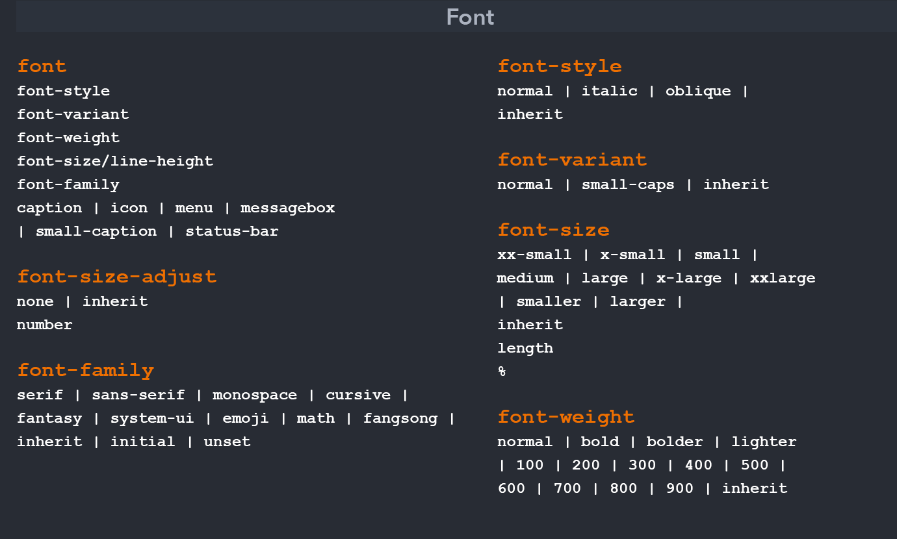

### Text

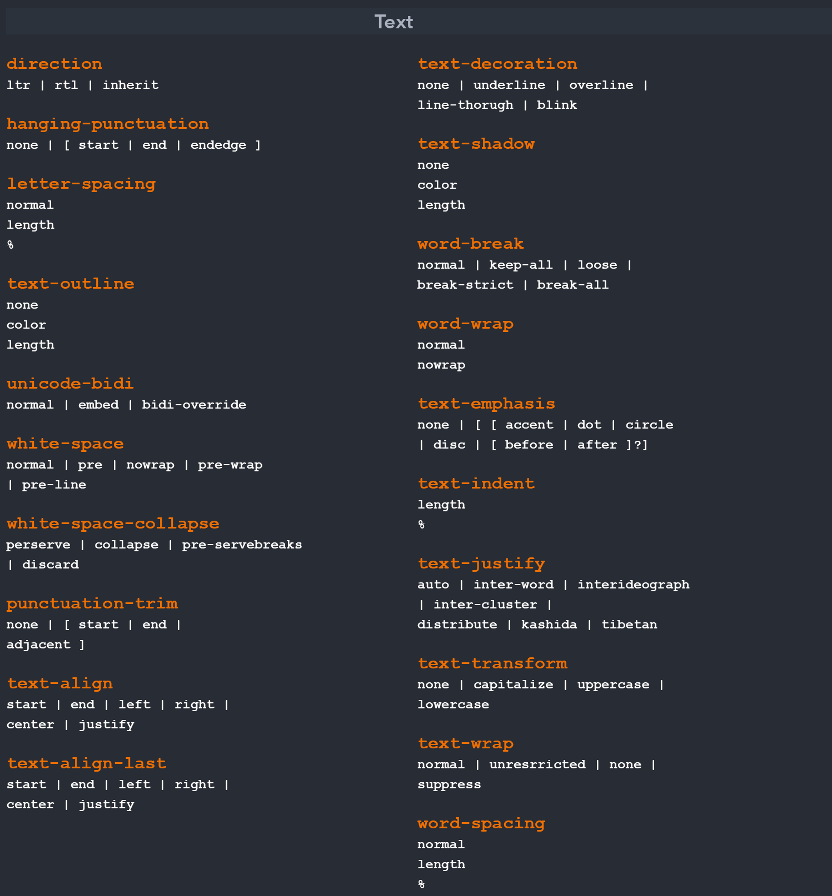

### Fons de pantalla

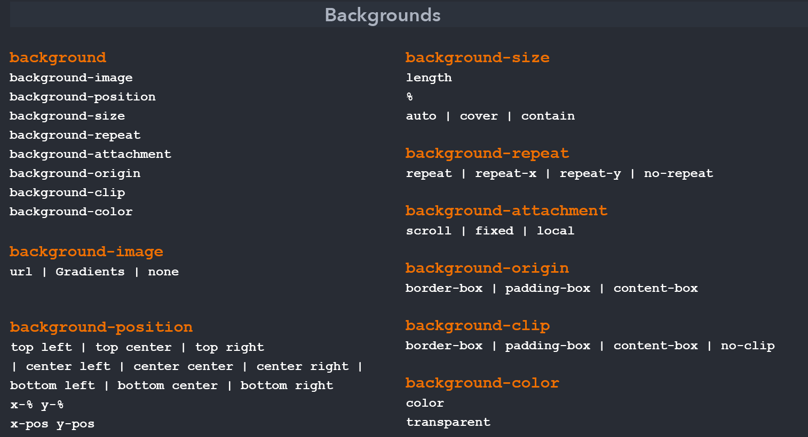

## Unitats

> En CSS podem fer servir molts **tipus d'unitats**.

Es poden definir atributs amb els següents formats:

**Valors absoluts:**

* `px` Pixels
* `cm` Centimetres
* `in` Polzades
* `pt` Punts (72 punts = 1 polzada)

**Valors relatius:**

* `%` Percentatges
* `em` (alçada "M")
* `ex` (alçada "x")

**Exemples:**

```css
width: 744px; 
margin-left: 1.25em; 
left: 34%; 
font-size: 12pt; 
margin-top: 1.25in; 
margin-bottom: 1.5cm;
```

**Més info a:** [https://www.w3.org/Style/Examples/007/units.en.html](https://www.w3.org/Style/Examples/007/units.en.html)

## Selectors

> Els **selectors** defineixen quin és l'element de la pàgina que modifiquem des del CSS.

Disposem de diversos **tipus** de selectors:

* Selectors de tipus o etiqueta HTML
* Selectors de classe
* Selectors ID
* Selectors descendents
* Selectors pseudoclasse: links
* Selectors pseudoelements
* Selector universal (\*)

### Selectors de tipus o etiqueta

> Seleccionen els elements de la pàgina a partir de la seva etiqueta HTML

**HTML**

```markup
<body>
    <h1> Títol 1 </h1>
    <h2> Títol 2 </h2>
</body>
```

**CSS**

```css
h1 { color: red; }
h2 { color: blue; }
```

**Visualització:**

### &#x20;Títol 1

#### &#x20;Títol 2

### Selectors de classe (.)

> Els **selectors de classe** seleccionen totes les etiquetes que tinguin el mateix atribut `class`.

Serveixen per declarar estils que s'utilitzaran **varies vegades**.

**HTML**

```markup
<body>
  <p class="destacat">Primer paràgraf</p>
  <p>Segon paràgraf</p>
</body>
```

Definim una classe donant-li un nom que podreu utilitzar en qualsevol altra etiqueta.

**CSS**

```css
.destacat { color: red; }
```

**Visualització:**

Primer paràgraf

Segon paràgraf

* **Només** els paràgrafs de classe `destacat` es mostraran de color vermell.

> **Varies** etiquetes de la pàgina poden utilitzar el mateix valor en l'atribut `class`.

### Selectors ID (#)

> Els **selectors ID** seleccionen qualsevol etiqueta que tingui l'identificador especificat en l'atribut `id`.

Serveixen per declarar estils que s'utilitzaran **UNA SOLA vegada**.

```markup
<body>
  <p>Olot</p>
  <p id="comarca">Garrotxa</p>
</body>
```

Definim una classe donant-li un nom que podreu utilitzar en qualsevol altra etiqueta.

**CSS**

```css
#comarca { color: red; }
```

**Visualització:**

Olot

Garrotxa

> El mateix valor en l'atribut `id` **NO es pot repetir** en dos etiquetes de la pàgina.

### Selectors descendents

> Selecciona les etiquetes que es trobin **dins** (descendents) de una altra d'etiqueta.

**HTML**

```markup
<body>
     <p>
         Consulteu la pàgina del <a href="www.w3.org">W3C</a>
     </p>
</body>
```

**CSS**

```css
p a { color: red; }
```

* **Només** els enllaços que siguin descendents d'un element `p` seran de color vermell.

**Visualització:**

&#x20;Consulteu la pàgina del [W3C](https://github.com/seicoll/xml/tree/efbc6bbbe9f8a8baea63114b48af8bf031721131/www.w3.org)

### Grups de selectors

> Permeten assignar el **mateix estil a diversos selectors**.

Són en realitat selectors, sinó una manera abreujada de definir estils.

```css
h1, h2, p {
    font-family: Trebuchet MS;
    color: olive;
    margin-left: 30px; 
}
```

### Selectors pseudoclasse: enllaços

CSS permet aplicar diferents estils al mateix enllaç en funció del seu **estat**.

* `:link`: Enllaços que encara no han sigut visitats
* `:visited`: Enllaços que ja han sigut visitats
* `:hover`: Enllaç que té el punter de ratolí a sobre
* `:active`: Enllaç que està prement l'usuari

```css
a:hover { 
      text-decoration: none;
      background-color: red;
      color: #FFF; 
}
```

[Exemple](https://www.w3schools.com/cssref/tryit.asp?filename=trycss\_sel\_hover)

### Selectors pseudoelements

> S'afegeixen a un selector per definir l'estil d'una part de l'element.

* **::first-letter**: Selecciona la primera lletra
* **::first-line**: Selecciona la primera línia
* **::selection**: Selecciona allò que l'usuari ha seleccionat amb el ratolí.

**HTML**

```markup
<body>
  <p>Primer paràgraf</p>
  <p>Segon paràgraf</p>
</body>
```

**CSS**

```css
p::first-letter { font-size: 200%; }
```

**Visualització:**

Primer paràgraf

Segon paràgraf

> CSS 3 afegeix molts més pseudoelements.

**Més exemples a**: [http://www.w3schools.com/css/css\_pseudo\_elements.asp](http://www.w3schools.com/css/css\_pseudo\_elements.asp)

### El selector universal (\*)

> Selecciona totes les etiquetes del document.

**HTML**

```markup
<body>
    <h1> Títol principal </h1>
    <p>Primer paràgraf </p>
    <p>Segon paràgraf </p>
</body>
```

**CSS**

```css
* {
    color: red;
}
```

**Visualització:**

### &#x20;Títol principal

Primer paràgraf

Segon paràgraf

### Selectors jeràrquics (germans i fills)

**Fill (A > B):** Selecciona qualsevol element B que és fill **directe** de A.

```css
div > p {
    color= #00FF00; 
}
```

**Germà (A + B):** Selecciona qualsevol element B **precedit immediatament** d'un element A.

```css
h1+p { 
    color=#00FF00; 
}
```

## Model de caixes (_Box Model_)

> Quan es visualitza qualsevol cosa amb CSS és tractada com si estes **dins d'una caixa** rectangular

Cada caixa té quatre components:


L'**ordre de visualització** des del punt de vista de l'usuari és:


### Amplada i alçada

* Els atributs `width` i `height` permeten definir la mida de la caixa.

```css
table { 
    width: 300px; 
    height:100px; 
}
```


> La **dimensió total** de l'element pot ser més gran si té margin i/o border.

### Margin i padding

* Per defecte els valors de margin, padding i border estan a zero.

Podem canviar-ne els valors amb les propietats:

* **Margin**: margin, margin-left, margin-right, margin-top, margin-bottom
*   **Padding**: padding, padding-left, padding-right, padding-top, padding-bottom

    ```css
      h1 { 
          margin: 3px; 
          padding-left:4px; 
      }
    ```

### Border

Amb el `border` hi ha moltes més possibilitats:

* **border-style:** pot ser `none, solid, dashet, dotted, double, groove, ridge, inset,outset`
* **border-width:** especifiquem l'amplada.
  * El més corrent és fer-ho amb pixels (Per exemple: 10px)
* **border-color:** el color que tindrà.
  * Pot ser amb el nom en anglès, amb la funció rgb() o en hexadecimal
* **border:** tot de cop especificant un rere l'altre amplada, estil i color.

```css
p { border-color:#000000; border-style:solid; }

p { border: 2px solid #000000; }
```

[Exemple](http://www.w3schools.com/css/css\_border.asp)

### Propietat box-sizing

Des dels inicis del CSS, el box model (model de caixa) ha funcionat així:

> **width real** visible d’un element de caixa = width + padding + border + margin **height real** visible d’un element de caixa = height + padding + border + margin


La gent s’ha adonant que que les matemàtiques no són divertides, de manera que s'ha creat una nova propietat **CSS3** anomenada `box-sizing`.

Quan s'estableix `box-sizing: border-box;` sobre un element, el padding i el border d'aquest element ja **no fa augmentar la seva amplada ni alçada total**.

`* { box-sizing: border-box; }`

Aquesta regla assegura que tots els elements sempre estan dimensionats d'una **manera més intuïtiva**.

```css
div {
    box-sizing: border-box;
    width: 200px;
    padding: 20px;
    border: 1px solid #DDD;
}
```

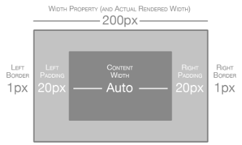

[Exemples](http://www.w3schools.com/cssref/css3\_pr\_box-sizing.asp)

## Elements de bloc i en línia

Les caixes es poden comportar de formes diferents en respecte a les altres.

El més corrent són dos comportaments:

* **block:**
  * Són posicionats **verticalment**.&#x20;
  * Blocs de contingut que ocupen tot l'espai d'una línia. Fa que la caixa defineixi un salt de línia rere seu.
* **inline:**
  * Són posicionats **horitzontalment**.
  * Les altres caixes permeten que les altres es posin al seu costat.


* El primer element és un **paràgraf** que ocupa tota la línia perquè és un element de _**block**_.
* El segon element és un **enllaç** que ocupa només l'espai necessari pel     seu contingut ja que és un element _**inline**_.

### inline-block

> Els elements inline **no poden tenir amplada**.

Per això s'han definit els _**inline-block**_.

Són elements inline que es comporten com un block:


## Amagar contingut

Una caixa serà **invisible** si se li aplica la propietat `visibility:hidden;`

Es reserva l'espai que ocupava l'etiqueta i queda buit.


## Eliminar contingut

Perquè una etiqueta **no es representi** es fa servir `display:none;`

L'espai que ocupava l'etiqueta queda lliure i és ocupat pels altres elements.


## Posicionament (_Layout_)

**CSS** permet modificar el posicionament en el que es mostra cada caixa.

Les tècniques de posicionament han anat variant amb el temps.  Van passar de **frames**, a **tables**, a divs (amb diferents tipus de posicionament) fins arribar el **Flexbox** i **Grid**.

El posicionament tipus de **posicionament clàssics** són:

* Posicionament **Estàtic o Normal**
* Posicionament **Relatiu**
* Posicionament **Flotant**
* Posicionament **Absolut**

S'utiliza la propietat `position`

```css
position: static | relative | absolute | fixed
```

### Posicionament Normal

Es tracta del funcionament **per defecte**.

> Les caixes apareixen una rere l'altra i de dalt a baix.

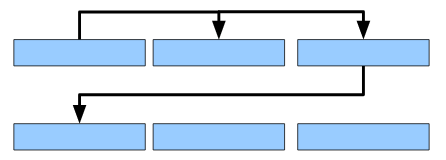

Només es té en compte si l'element és en bloc o en línia.

### Posicionament Relatiu

Consisteix en posicionar la caixa segons el posicionament normal i llavors **desplaçar-la respecte de la seva posició original**.

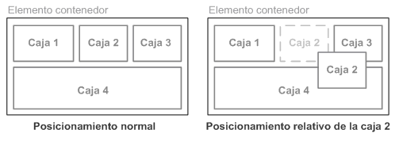

* Canviar la posició relativa pot fer que el contingut de dues caixes quedi **superposat**.
* Es marca la posició original de l'element com a protegida (la resta de caixes es pensen que encara hi és).

El desplaçament de la caixa es controla amb les **propietats** `top`, `right`, `bottom` i `left`.

* `top`, `right`, `bottom` i `left` es calculen respecte la posició original de la caixa.

```css
.box1 {
    position: relative;
    top: 25px;
    right: 25px;
}
```

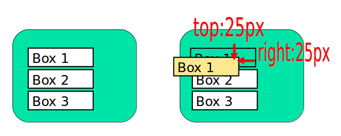

* `top:25px;`: es desplaça 25 píxels des de dalt de la posició normal de la caixa (es desplaça cap a baix).
* `right:25px;`: es desplaça 25 píxels de la dreta de la posició original (es desplaça cap a l'esquerra).

### Posicionament Absolut

Es pot posicionar una caixa **en un lloc concret** fent servir `position:absolute;`

```css
.box1 {
    position: absolute;
    top: 25px;
    right: 80px;
}
```


* Treu l'element del fluxe normal.
* L'element _**s'eleva**_ i tots els altres elements es comporten com si no hi fos.
  * La resta del contingut no quedarà al voltant sinó que pot quedar per **sota**.
* El posicionament absolut d'un element **fa referència al seu contenidor**.
  * És a dir que `top`, `right`, `bottom` o `left` depenen del seu contenidor.
  * Si no hi ha cap element contenidor, els valos faran referència a l'element més alt de l'estructura HTML (el `body`).

**Posicionament fixed**

Un cas especial de posicionament absolut és el **posicionament fix**.

Ens fixa una caixa en la pantalla de manera que **no es mourà** encara que es mogui la pàgina amunt o avall.

```markup
.box1{ 
    position:fixed; 
    right:0px; 
    top:0px; 
}
```


[Exemple posicionament fixed](https://www.w3schools.com/cssref/playit.asp?filename=playcss\_position\&preval=fixed)&#x20;

### Posicionament Flotant

Podem definir una **caixa flotant** que deixa que les altres caixes es posin al seu voltant amb la propietat `float`.

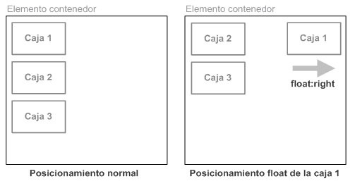

* La caixa que hem definit `float:right;` es posa primer, al més a la dreta o esquerra possible, i les altres es posen al seu voltant sense sobreesciure-la.

La propietat `clear` permet anul·lar el comportament per introduït per la propietat float.


* `clear: left;` anul·la els elements floants a l'esquerra.

[Exemple clear](https://www.w3schools.com/cssref/tryit.asp?filename=trycss\_class-clear)

El paràmetre `clear` pot tenir diferents valors:

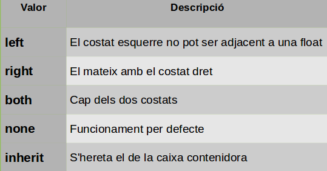

## Posicionament Flexbox

El **2009** el W3C comença a treballar en la especificació de **Flexbox.**

**Flexbox** ve a solucionar un dels majors mals de caps dels dissenyadors de pàgines web: com era crear pàgines **responsive** que funcionin en l'àmplia varietat de dispositius.

**Flexbox** es crea un nou model de caixa, la caixa flexible o FlexBox amb&#x20;

`display: flex`

**Què ens permet controlar?**

* La **orientació** dels elements.
* La **distribució de l’espai** que ocupen els elements, inclòs si les seves mides són desconegudes o dinàmiques.
* L’**ordre** dels elements.
* L’**espai entremig** dels elements.

### Propietats per la caixa pare (Flex container)

#### Propietat display

```css
.container {
    display: flex;
}
```

La declaració `display: flex;` defineix:

* Un **Flex container** (_**contenidor flexible**_) : element pare que conté elements flexibles.
* Converteix de forma automàtica als seus **fills** directes a **Flex items** (_**elements flexibles**_).

<figure><figcaption></figcaption></figure>

Un **Flex container** té dos eixos:

* Un **Main axis** (_Eix principal_): és l’eix que estableix la direcció en la qual es posicionen els elements flexibles.&#x20;
  * En l’exemple es tracta d’un **flex container row** ja que es posicionen de forma horitzontal.&#x20;
* I un **Cross axis** (_Eix transversal_), perpendicular a l'Eix principal.

Els elements es col·locaran seguint la **direcció** del Main axis o bé Cross axis:

* main-start | main-end
* cross-start | cross-end

#### Propietat flex-direction

La propietat `flex-direction` especifica la **direcció respecte l’eix principal** en la qual es posicionen els elements flexibles.&#x20;

<figure><figcaption></figcaption></figure>

```css
.container {
  flex-direction: row | row-reverse | column | column-reverse;
}
```

El valors acceptats són:&#x20;

* **row** (default): de dreta a esquerra&#x20;
* **row-reverse**: d’esquerra a dreta&#x20;
* **column**: de dalt a baix&#x20;
* **column-reverse**: de baix a dalt

**Exemple:** [http://jsfiddle.net/seicoll/0p287xwk/1/](http://jsfiddle.net/seicoll/0p287xwk/1/)

#### Propietat flex-wrap

Per defecte els elements flexibles es situen tots en **una única** **fila**.

La propietat `flex-wrap` permet especificar que els elements flexibles es col·loquin en **varies files** i la **direcció d’aquestes files**.

<figure><figcaption></figcaption></figure>

```css
.container {
  flex-wrap: nowrap | wrap | wrap-reverse;
}
```

Els valors acceptats són:&#x20;

* **nowrap** (default): el contenidor té un única línia.&#x20;
* **wrap**: el contenidor té múltiples línies&#x20;
* **wrap-reverse**: el contenidor té múltiples línies que es col·loquen en ordre invers

**Exemple:** [https://jsfiddle.net/seicoll/7286hsdu/](https://jsfiddle.net/seicoll/7286hsdu/)

#### propietat flex-flox

La propietat `flex-flow` és un forma abreviada de les propietats `flex-direccion` i `flex-wrap`.

```css
flex-direccion: column;
flex-wrap: wrap;
```

Equival a:

```css
.container {
  flex-flow: column wrap;
}
```

#### Propietat justify-content

Defeneix l'**alineament** dels elements respecte l'eix principal (**Main Axis**).

Si hi ha **espai extra** dins d'un contenidor flexible la propietat justify-content defineix com s'usa aquest espai que sobra.&#x20;

<figure><figcaption></figcaption></figure>

```css
.container {
  justify-content: flex-start | flex-end | center | space-between | space-around | space-evenly | start | end | left | right ... + safe | unsafe;
}
```

Les opcions són:

* **flex-start**: es distribueixen tots enganxats a l'inici del flex-direction.&#x20;
* **flex-end**: es distribueixen tots enganxats al final del flex-direction.&#x20;
* **center**: es distribueixen tots alineats al centre.&#x20;
* **space-between**: es distribueixen ocupant tot l'espai disponible, amb separacions iguals entre ells, però sense deixar espai a l'inici i al final.&#x20;
* **space-around**: es distribueixen ocupant tot l'espai disponible, amb separacions iguals entre ells, deixant espai a l'inici i al final.
* **space-evenly:** es distribueixen ocupant tot l'espai disponible, amb separacions iguals entre ells i al l'inici i final.

#### Propietat align-items

Defeneix l'**alineament** dels elements respecte l'eix transversal (**Cross Axis**).

<figure><figcaption></figcaption></figure>

```css
.container {
  align-items: stretch | flex-start | flex-end | center | baseline | first baseline | last baseline | start | end | self-start | self-end + ... safe | unsafe;
}
```

**El valors acceptats són:**

* flex-start
* flex-end
* center
* strech (default)
* baseline

### Propietat per les caixes filles (Flex items)

#### Propietat order

Permet **establir l'ordre** en què apareixen els components dins d'una caixa flexible.&#x20;

Per defecte apareixeran tal com apareixen en el codi HTML (equival a order: 0).

<figure><figcaption></figcaption></figure>

```css
.item {
  order: 5; /* default is 0 */
}
```

#### Propietat flex-grow

Permet establir **com creix** un element flexible dins del contenidor en relació als altres quan hi ha espai disponible del contenidor a ocupar.&#x20;

La propietat `flex-grow` especifica el **factor de creixement**. Per defecte és '0',

<figure><figcaption></figcaption></figure>

#### Propietat flex-shrink

Permet establir **com decreix** un element flexible dins del contenidor en relació als altres quan falta espai al contenidor.

La propietat flex-shrink especifica el **factor de reducció**. Per defecte és '1'.&#x20;

Si posem el valor '0', l’element flexible no es reduirà.

#### Propietat flex-basis

Estableix la **mida inicial de l'element** abans de distribuir l'espai lliure d'acord amb les ràtios de flex-grow o flex-shrink.&#x20;

Pren el mateix valor que la propietat width i quan s'omet, el seu valor és 'main-size' (anteriorment,'auto').

#### Propietat flex

Estableix **com creix o decreix un element** flexible dins del contenidor en relació als altres.&#x20;

És un forma abreviada de les propietats `flex-grow`, `flex-shrink` i `flex-basis`.&#x20;

```css
flex: <'flex-grow'> || <'flex-shrink'> || <'flex-basis'>
```

El segon i tercer paràmetres (`flex-shrink` i `flex-basis`) són opcionals.

**Es recomana utilitzar aquesta forma abreujada** enlloc de les propietats individuals. La forma abreujada estableix els altres valors de forma intel·ligent.

#### Propietat align-self

Estableix l'**alineament** dels elements individuals sobreescrivint la propietat `align-items`.&#x20;

<figure><figcaption></figcaption></figure>

El valors acceptats són:&#x20;

* auto&#x20;
* flex-start&#x20;
* flex-end&#x20;
* center&#x20;
* baseline&#x20;
* strech

**Més informació**

CSS-Tricks: A Complete Guide to Flexbox&#x20;

[https://css-tricks.com/snippets/css/a-guide-to-flexbox/](https://css-tricks.com/snippets/css/a-guide-to-flexbox/)

**Anem a practicar:**&#x20;

* [http://flexboxfroggy.com/ ](http://flexboxfroggy.com/)
* [http://www.flexboxdefense.com/](http://www.flexboxdefense.com/)


[Flexbox (Caixes Flexibles)](https://docs.google.com/presentation/d/1bYzqqzCPcE\_B-3uv4dV2VIjzVIOSLCfaCsxBLpuAlEk/edit?usp=sharing)

## Resum visual de posicionaments

### Inline vs block


### Absolute

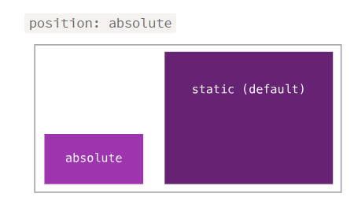

### Fixed

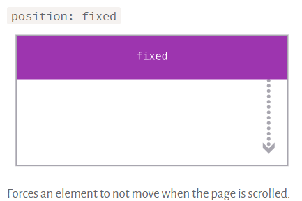

### Relatiu

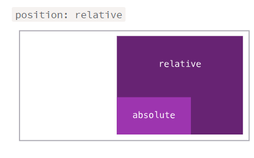

### Float


### Z-index

Controla la profunditat de les capes

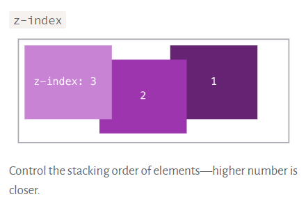
