# CSS (Cascade Style Sheets)

## Introducció

> Els **Cascading Style Sheets (CSS)** són la forma de donar format a les dades d'un document.

Les possibilitats de format de CSS es poden dividir en 3 àrees:

* **Fonts i colors**: format del contingut
* **Distàncies i marcs**
* **Layout**: modificar la posició dels elements de la pàgina web

Abans que es generalitzés l'ús dels **CSS**, s'utilitzaven etiquetes especials per modificar l'aspecte dels elements d'una pàgina.

```html
<body>
  <h1><font color="red" face="Arial" size="5">Titular de la pàgina</font></h1>
  <p><font color="gray" face="Verdana" size="2">Un paràgraf de text.</font></p>
  <p><font color="gray" face="Verdana" size="2">Un altre paràgraf de text.</font></p>
</body>
```

En els sites amb moltes pàgines, els **canvis de formats** de eren **molt laboriosos**.
* Calia anar element per element, a cada pàgina!!

### Avantatges del CSS

* Permet **separar el contingut de la seva presentació**.
* Permet **definir les regles de presentació** d'un document a partir de les etiquetes que conté.
* Permet aplicar les regles de presentació a **múltiples pàgines**.

### Versions

* **CSS 1** (1996)
* **CSS 2** (1998) 
* **CSS 2.1** es finalitza al 2011.
* **CSS 3** (versió actual) 


## Utilització dels CSS

Per **aplicar fulles d'estil CSS a HTML** es pot fer a través de tres formes:

* CSS **intregades** en un element HTML5 
  * Amb l'atribut `style`  en etiquetes html.

* CSS **internes** al document 
  * Amb una etiqueta `<style>`


* CSS **externes** al document 
  * Amb un arxiu extern .css i utilitzant l'etiqueta `<link>`


## CSS intregades en una etiqueda html

Permet especificar regles CSS d'una etiqueta HTML.
> És la forma **menys recomanada** de fer-ho ja que complica la compartició.

Es col·loca dins d'una etiqueta de HTML amb l'atribut `style`


**Exemple 1: Estil definit per una etiqueta**

```html
<p style="color:#990000">
   Això és un paràgraf de color vermell
</p> 
<p style="color:#000099">
   Això és un paràgraf de color blau
</p> 
```

El resultat serà:


**Exemple 2: Estil definit en petites parts d'una pàgina**

Mitjançant l'etiqueta `<span>` i l'atribut `style`.

```html
<p>
   Això és un paràgraf que té diverses paraules  
   <SPAN style="color:green">de color verd</SPAN>. fàcil, no?
</p>
```

El resultat serà:


**Exemple 3: Estil definit en una part de la pàgina**

Mitjançant l'etiqueta `<div>` i l'atribut `style`.

```html
<div style="color:#000099; font-weight:bold">
    <h3>Aquestes etiquetes van en <i>blau i negreta</i></h3>
    <p>
        Seguim dins del DIV, encara funcionen els estils
    </p> 
</div>
```

El resultat serà:


##  CSS internes al document 

* Permet especificar regles **CSS dins del document** HTML.
* Estil definit s'aplicarà a tota la pàgina HTML.
* **No** és la forma més recomanada de fer-ho ja que complica la compartició.
* Es defineixen dintre del `<head>`.
* S'utilitza l'etiqueta `<style>` i `</style>`

```html
<html>
<head>
   <title>Exemple d'estils en una pàgina</title>
   <style>
       h1 {
          text-decoration: underline;
          text-align:center
        }
        p {
          font-Family:arial,verdana; 
          color: white; 
          background-color: black
        }
        body {
          color:black;
          background-color: #cccccc; 
          text-indent:1cm
        }
    </style>
</head> 
<body>
   <h1>Pàgina amb estils</h1>
   Benvinguts
   <p>n-èssim exemple sense massa importància en el contingut</p>
</body>
</html>
```

**El resultat serà:**


## CSS Externes

* Estil definit per **tot un lloc web**.
* Es crea un **arxiu a part** on guardem tota la informació d'estils de la pàgina.

> **És el millor sistema**. És reaprofitable per totes les pàgines del lloc web.

**Exemple de document CSS:**

```css
p  {
 font-size : 12pt;
 font-family : arial,helvetica;
 font-weight : normal;
} 
h1  {
 font-size : 36pt;
 font-family : verdana, arial;
 text-decoration : underline;
 text-align : center;
 background-color : Teal;
}
td  {
 font-size : 10pt;
 font-family : verdana, arial;
 text-align : center;
 background-color : 666666;
}
body  {
 background-color : #006600;
 font-family : arial;
 color : White;
}
```

### Associar full d'estils CSS a una pàgina HTML

Un cop tenim creat l'arxiu CSS, l'hem d'**enllaçar** amb les diferents pàgines que tenim, mitjançant l'etiqueta `<link>`

```html
<head>
   <link rel="stylesheet" href="estil.css">
</head>
```

* `rel="stylesheet"`: indica que l'enllaç és una fulla d'estils.
* `href="estil.css"`: indica el nom del fitxer CSS dels estils.

## Regles CSS

> Les **regles CSS** defineixen de quina forma es representaran les diferents etiquetes HTML de la pàgina.

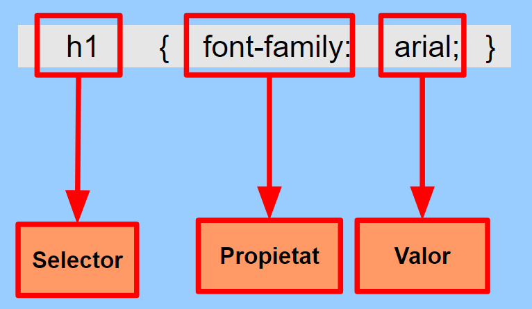

Si volem especificar **més d'una propietat** en una regla CSS:
* Es posen una darrere l'altra dins dels corxets.
* Separades amb un punt i coma ( `;` )

**Exemple:**

```css
h1 {       
    font-size: 10pt; 
    text-decoration: underline; 
    color: black; 
    font-family:arial;
    background-color:#00FF00; 
}
```

## Regles d'ús

### Cascada

> La "C" de CSS vol dir "***Cascading***".

És possible tenir varies definicions d'estil (externes, internes i integrades en etiqueta).

En cas que hi hagi un **conflicte entre els estils** definits s'aplica la següent prioritat:

**De menor a major prioritat:**
* 1er. Estils predeterminats del **navegador**.
* 2on. Fulles d'estil **externes** (en un arxiu CSS separat).
* 3er. Fulles d'estil **internes** (en el `<head>`).
* 4rt. Estils **integrats** en etiquetes HTML.

**Per exemple:**

```html
<html>
<head>
    <style>
        h1 {
            color: blue;
        }
    </style>
</head>
<body>
    <h1 style="color:red">Títol</h1>
</body>
</html>
```

**De quin color es veurà el text del títol, vermell o blau?**

#### Selectors repetits

Si **repetim una etiqueta en el mateix nivell** i s'hi repeteix alguna propietat, el darrer valor és el vàlid.

```css
h1 { 
    font-family:arial;
    color: blue;
}

h1 { color:red; }
```

El contingut de les etiquetes h1 es pintarà de color vermell perquè és la **última definició** que s'ha trobat

### Herència

> Els estils CSS s'hereden d'una etiqueta a un altre.

**Exemple:** 

```css
body { font-family:arial;
       color:#FF0000;
       background-color:#00FF00; }

h2 { font-style: italic; }
```
Definim l'estil del `<body>` i per tant les etiquetes de dins tenen el mateix estil.
* `h2` a més de les característiques anteriors estarà en cursiva.

## Comentaris

> CSS permet incloure **comentaris** entre les seves regles.

* Els navegadors ignoraran aquests comentaris.
* S'indiquen mitjançant els caràcters `/*` i `*/`

**Exemple:**

```css
/* Això és un comentari en CSS */
```

> **Alerta!** El comentaris s'envien al navegador juntament amb la resta d'estils, per tant no es poden incloure dades confidencials.

## Propietats CSS

CSS defineix moltes **propietats** i a cada versió n'afegeixen més

Les propietats poden ser agrupades en quatre grans **grups**:

* Propietats de tipus de lletres
* Propietats de text
* Propietats de fons de pantalla
* Propietats de caixes

### Tipus de lletra


### Text


### Fons de pantalla


## Unitats

> En CSS podem fer servir molts **tipus d'unitats**.

Es poden definir atributs amb els següents formats:

**Valors absoluts:**

* `px` Pixels
* `cm` Centimetres
* `in` Polzades
* `pt` Punts (72 punts = 1 polzada)


**Valors relatius:**

* `%` Percentatges
* `em` (alçada "M")
* `ex` (alçada "x")

**Exemples:**

```css
width: 744px; 
margin-left: 1.25em; 
left: 34%; 
font-size: 12pt; 
margin-top: 1.25in; 
margin-bottom: 1.5cm; 
```

**Més info a:** <https://www.w3.org/Style/Examples/007/units.en.html>

## Selectors

> Els **selectors** defineixen quin és l'element de la pàgina que modifiquem des del CSS.

Disposem de diversos **tipus** de selectors:

-   Selectors de tipus o etiqueta HTML
-   Selectors de classe
-   Selectors ID
-   Selectors descendents
-   Selectors pseudoclasse: links
-   Selectors pseudoelements
-   Selector universal (*)

### Selectors de tipus o etiqueta

> Seleccionen els elements de la pàgina a partir de la seva etiqueta HTML

**HTML**

```html
<body>
    <h1> Títol 1 </h1>
    <h2> Títol 2 </h2>
</body>
```

**CSS**

```css
h1 { color: red; }
h2 { color: blue; }
```

**Visualització:**

<div style="border: 1px solid gray; padding: 7px">
    <h3  style="color:red"> Títol 1 </h3>
    <h4 style="color:blue"> Títol 2 </h4>
</div>

### Selectors de classe (.)

> Els **selectors de classe** seleccionen totes les etiquetes que tinguin el mateix atribut `class`.

Serveixen per declarar estils que s'utilitzaran **varies vegades**.

**HTML**

```html
<body>
  <p class="destacat">Primer paràgraf</p>
  <p>Segon paràgraf</p>
</body>
```
 Definim una classe donant-li un nom que podreu utilitzar en qualsevol altra etiqueta.

**CSS**

```css
.destacat { color: red; }
```

**Visualització:**

<div style="border: 1px solid gray; padding: 7px; margin-bottom:10px">
    <p style="color:red">Primer paràgraf</p>
    <p>Segon paràgraf</p>
</div>


* **Només** els paràgrafs de classe `destacat` es mostaran de color vermell.

> **Varies** etiquetes de la pàgina poden utilitzar el mateix valor en l'atribut `class`.


### Selectors ID (#)


> Els **selectors ID** seleccionen qualsevol etiqueta que tingui l'identificador especificat en l'atribut `id`.

Serveixen per declarar estils que s'utilitzaran **UNA SOLA vegada**.

```html
<body>
  <p>Olot</p>
  <p id="comarca">Garrotxa</p>
</body>
```
 Definim una classe donant-li un nom que podreu utilitzar en qualsevol altra etiqueta.

**CSS**

```css
#comarca { color: red; }
```

**Visualització:**

<div style="border: 1px solid gray; padding: 7px; margin-bottom:10px">
    <p>Olot</p>
    <p style="color:red">Garrotxa</p>
</div>

> El mateix valor en  l'atribut `id` **NO es pot repetir** en dos etiquetes de la pàgina.


### Selectors descendents

> Selecciona les etiquetes que es trobin **dins** (descendents) de una altra d'etiqueta.


**HTML**

```html
<body>
     <p>
         Consulteu la pàgina del <a href="www.w3.org">W3C</a>
     </p>
</body>

```

**CSS**

```css
p a { color: red; }

```
* **Només** els enllaços que siguin descendents d'un element `p` seran de color vermell.
  
**Visualització:**

<div style="border: 1px solid gray; padding: 7px">
    <p>
         Consulteu la pàgina del <a style="color:red" href="www.w3.org">W3C</a>
     </p>
</div>

### Grups de selectors

> Permeten assignar el **mateix estil a diversos selectors**.

Són en realitat selectors, sinó una manera abreujada de definir estils. 

```css
h1, h2, p {
    font-family: Trebuchet MS;
    color: olive;
    margin-left: 30px; 
}
```

### Selectors pseudoclasse: enllaços

CSS permet aplicar diferents estils al mateix enllaç en funció del seu **estat**.

* `:link`: Enllaços que encara no han sigut visitats
* `:visited`: Enllaços que ja han sigut visitats
* `:hover`: Enllaç que té el punter de ratolí a sobre
* `:active`: Enllaç que està prement l'usuari

```css
a:hover { 
      text-decoration: none;
      background-color: red;
      color: #FFF; 
}
```

[Exemple](https://www.w3schools.com/cssref/tryit.asp?filename=trycss_sel_hover)

### Selectors pseudoelements

> S'afegeixen a un selector per definir l'estil d'una part de l'element.

* **::first-letter**: Selecciona la primera lletra
* **::first-line**: Selecciona la primera línia
* **::selection**: Selecciona allò que l'usuari ha seleccionat amb el ratolí.

**HTML**

```html
<body>
  <p>Primer paràgraf</p>
  <p>Segon paràgraf</p>
</body>
```

**CSS**

```css
p::first-letter { font-size: 200%; }
```

**Visualització:**

<div style="border: 1px solid gray; padding: 7px; margin-bottom:20px">
    <p><span style="font-size:200%">P</span>rimer paràgraf</p>
    <p><span style="font-size:200%">S</span>egon paràgraf</p>
</div>


> CSS 3 afegeix molts més pseudoelements.

**Més exemples a**: <http://www.w3schools.com/css/css_pseudo_elements.asp>

### El selector universal (*)

> Selecciona totes les etiquetes del document.

**HTML**

```html
<body>
    <h1> Títol principal </h1>
    <p>Primer paràgraf </p>
    <p>Segon paràgraf </p>
</body>
```

**CSS**

```css
* {
    color: red;
}
```

**Visualització:**

<div style="border: 1px solid gray; padding: 7px">
    <h3  style="color:red"> Títol principal </h3>
    <p style="color:red">Primer paràgraf </p>
    <p  style="color:red">Segon paràgraf </p>
</div>

### Selectors jeràrquics (germans i fills)

**Fill (A > B):** Selecciona qualsevol element B que és fill **directe** de A.

```css
div > p {
    color= #00FF00; 
}
```

**Germà (A + B):**  Selecciona qualsevol element B **precedit immediatament** d'un element A.

```css
h1+p { 
    color=#00FF00; 
}
```

## Model de caixes (*Box Model*)

> Quan es visualitza qualsevol cosa amb CSS és tractada com si estes **dins d'una caixa** rectangular

Cada caixa té quatre components:

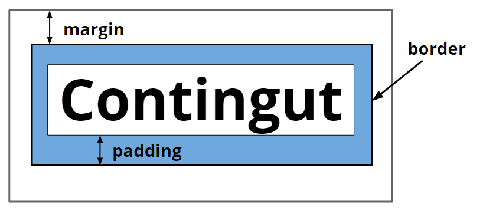

L'**ordre de visualització** des del punt de vista de l'usuari és:

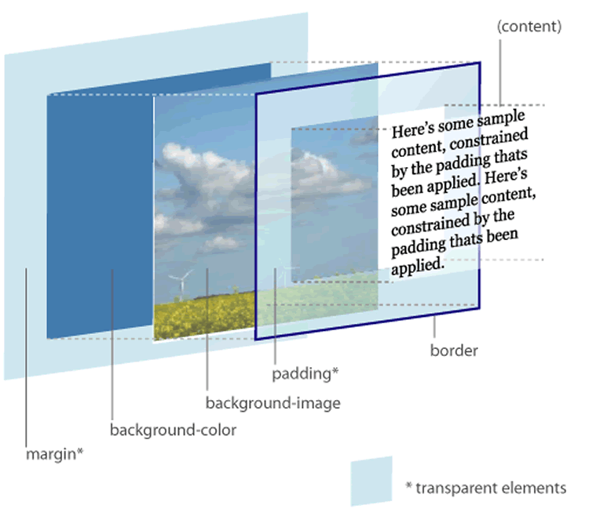

### Amplada i alçada

* Els atributs `width` i `height` permeten definir la mida de la caixa.

```css
table { 
    width: 300px; 
    height:100px; 
}
```

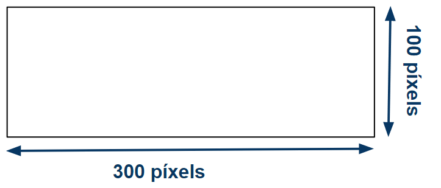

> La **dimensió total** de l'element pot ser més gran si té margin i/o border.


### Margin i padding

* Per defecte els valors de margin, padding i border estan a zero.

Podem canviar-ne els valors amb les propietats:

* **Margin**:   margin, margin-left, margin-right, margin-top, margin-bottom

* **Padding**:   padding, padding-left, padding-right, padding-top, padding-bottom

 ```css
    h1 { 
        margin: 3px; 
        padding-left:4px; 
    }
 ```

### Border

Amb el `border` hi ha moltes més possibilitats:

* **border-style:** pot ser `none, solid, dashet, dotted, double, groove, ridge, inset,outset`

* **border-width:** especifiquem l'amplada. 
  * El més corrent és fer-ho amb pixels (Per exemple: 10px)

* **border-color:** el color que tindrà. 
  * Pot ser amb el nom en anglès, amb la funció rgb() o en hexadecimal

* **border:** tot de cop especificant un rere l'altre amplada, estil i color.

```css
p { border-color:#000000; border-style:solid; }

p { border: 2px solid #000000; }
```

[Exemple]( http://www.w3schools.com/css/css_border.asp)

## Elements de bloc i en línia

Les caixes es poden comportar de formes diferents en respecte a les altres. 

El més corrent són dos comportaments:

* **block:** 
  * Són posicionats **verticalment**. 
  * Blocs de contingut que ocupen tot l'espai d'una línia. Fa que la caixa defineixi un salt de línia rere seu.
 
* **inline:** 
  * Són posicionats **horitzontalment**.
  * Les altres caixes permeten que les altres es posin al seu costat.

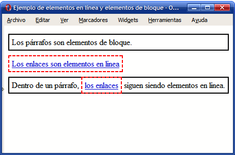

* El primer element és un **paràgraf** que ocupa tota la línia perquè és un element de ***block***.
* El segon element és un **enllaç** que ocupa només l'espai necessari pel     seu contingut ja que és un element ***inline***.

### inline-block

> Els elements inline **no poden tenir amplada**.

Per això s'han definit els ***inline-block***.
 
Són elements inline que es comporten com un block:

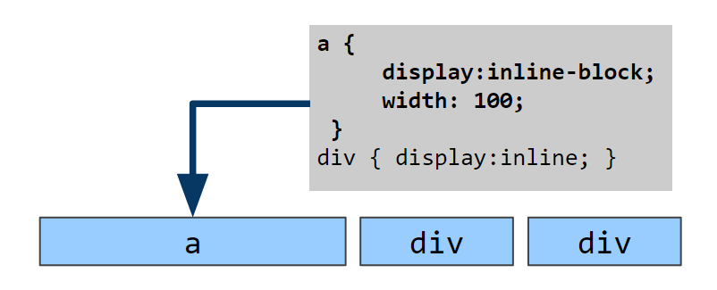

## Amagar contingut

Una caixa serà **invisible** si se li aplica la propietat `visibility:hidden;`

Es reserva l'espai que ocupava l'etiqueta i queda buit.

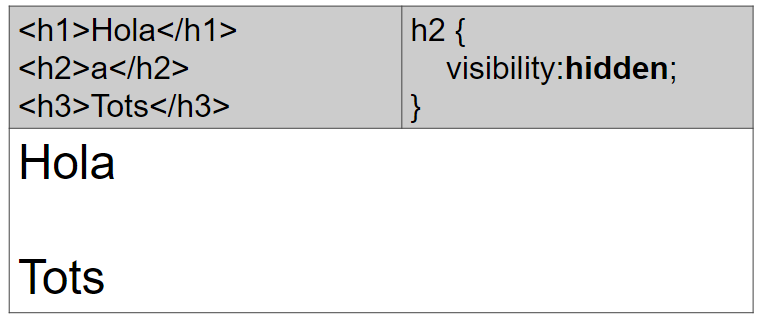

## Eliminar contingut

Perquè una etiqueta **no es representi** es fa servir `display:none;`

L'espai que ocupava l'etiqueta queda lliure i és ocupat pels altres elements.

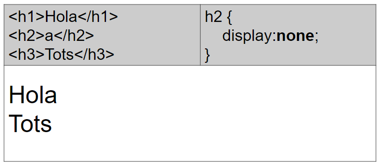

  


## Posicionament (*Layout*)

**CSS** permet modificar el posicionament en el que es mostra cada caixa.

El posicionament en CSS reposa sobre quatre opcions:

* Posicionament **Estàtic o Normal**
* Posicionament **Relatiu**
* Posicionament **Flotant**
* Posicionament **Absolut**

S'utiliza la propietat `position`

```css
position: static | relative | absolute | fixed
```

---

### Posicionament Normal

Es tracta del funcionament **per defecte**.

> Les caixes apareixen una rere l'altra i de dalt a baix.


Només es té en compte si l’element és en bloc o en línia.


### Posicionament Relatiu

Consisteix en posicionar la caixa segons el posicionament normal i llavors **desplaçar-la respecte de la seva posició original**.


* Canviar la posició relativa pot fer que el contingut de dues caixes quedi **superposat**.

* Es marca la posició original de l'element com a protegida (la resta de caixes es pensen que encara hi és).

El desplaçament de la caixa es controla amb les **propietats** `top`, `right`, `bottom` i `left`.
  * `top`, `right`, `bottom` i `left` es calculen respecte la posició original de la caixa.


* `top:25px;`: es desplaça 25 píxels des de dalt de la posició normal de la caixa (es desplaça cap a baix).

* `right:25px;`: es desplaça 25 píxels de la dreta de la posició original (es desplaça cap a l'esquerra).


### Posicionament Absolut

* Es pot posicionar una caixa en un lloc concret fent servir `position:absolute;`


* Treu l'element del fluxe normal.
* L'element ***s'eleva*** i tots els altres elements es comporten com si no hi fos.
* La resta del contingut no quedarà al voltant sinó que pot quedar per **sota**.

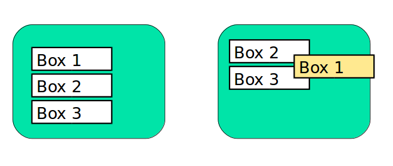

* El posicionament absolut d'un element fa referència al seu contenidor.<!--, ja sigui amb *relative*, *absolut* o *fixed*.-->
* És a dir que `top`, `right`, `bottom` o `left` depenen del seu contenidor.
* Si no hi ha cap element contenidor, els valos faran referència a l'element més alt de l'estructura HTML (el `body`).


<!--
**Consell absolut**

> Fer les posicionaments absolut dins d'un posicionament relatiu, sense cap valor.


**Exemple absolut sobre relative**


-->

**Posicionament fixed**

Un cas especial de posicionament absolut és el **posicionament fix**.

Ens fixa una caixa en la pantalla de manera que **no es mourà** encara que es mogui la pàgina amunt o avall.

```html
.box1{ 
    position:fixed; 
    right:0px; 
    top:0px; 
}
```


### Posicionament Flotant

'float' ens permet especificar una caixa flotant que deixa que les
altres caixes es posin al seu voltant


-   La caixa que hem definit float:left es posa primer i les altres es
    posen al seu voltant sense sobreesciure-la

El paràmetre “clear” pot tenir diferents valors:


## Resum visual de posionaments

### Inline vs block

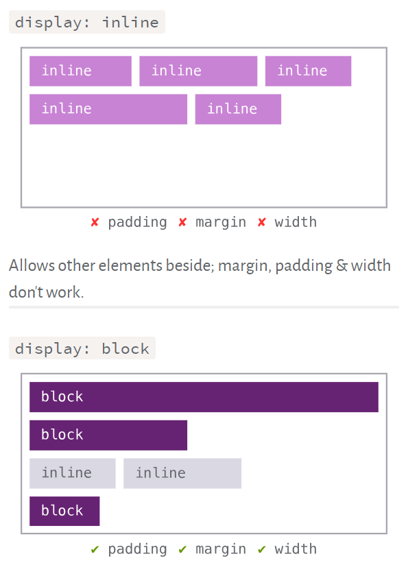

### Absolute


### Fixed


### Relatiu


### Float

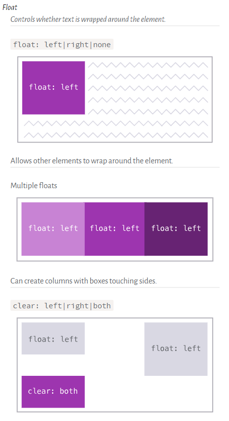

### Z-index

Controla la profunditat de les capes


