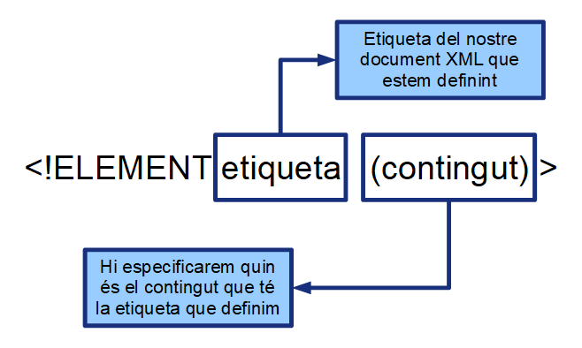
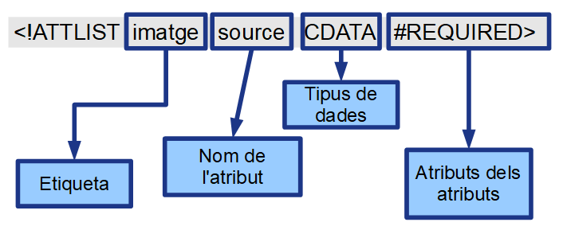

# Validació XML amb DTD

## Introducció

*  Validació de documents:

## Què és el DTD?


> El **DTD** (*Document Type Definitions*) és la forma de definició d'esquemes que va sortir primer.
* Va sorgir en el temps del **SGML**

L'**objectiu principal** dels DTD és donar un mecanisme per validar les estructures dels documents XML.
  * El document XML es comprovarà amb l'esquema DTD.

> **Hi poden haver documents ben formats que no siguin vàlids**.

El DTD pot ser compartit entre organitzacions o fins i tot definir-lo com a estàndard públic.
  * Això permetrà conèixer les especificacions que defineixen un vocabulari concret.

## Limitacions del DTD

* El DTD **no** és un llenguatge XML: Això obliga a aprendre dos llenguatges en comptes d'un!
* Pot ser que no puguem fer-hi tot el que ens faci falta: 
  * DTD no pot fer comprovacions del contingut de dades:

  ```xml
  <data>.</data>
  ```
    * No pot comprovar que és una data correcte.


* Podria fer falta definir restriccions en el document però amb DTD no es pot: 
  * Per exemple una data entre 1970 i 2032.

Encara hi ha molts documents XML que es validen amb DTD (tot i que té les seves limitacions).

## Validació

Amb **xmllint** ho podem fer amb `valid`:

```bash
$ xmllint --noout --valid exercici.xml
```

També es pot fer amb el programa **XML Copy Editor**, etc...


O amb validadors **online**:

* XML Validator Online: https://www.xmlvalidation.com/
* XML Validator: http://xmlvalidator.new-studio.org/


## Definició del DTD 

### Definició de DTD Interna


-   Es poden incorporar DTD dins dels documents XML

```xml
<?xml version="1.0" encoding="UTF-8" ?>
<!DOCTYPE process [
<!ELEMENT adress (#PCDATA)>
<!ELEMENT process (adress)>
]>
<process>
    <adress>http://www.boscdelacoma.cat</adress>
</process>
```

-   Tot i que es pot fer és millor fer-los externs.
-   Definir-los externament permet compartir-los més fàcilment i a més:

> Separa les dades de la estructura.

### Definició de DTD Externa

Per definir un DTD extern que s'utilitza fent servir l'etiqueta `DOCTYPE` dins del document XML:

* Es poden definir **DOCTYPES** d'Internet:

```xml
<?xml version="1.0" encoding="UTF-8" ?>
<!DOCTYPE alumnes SYSTEM "http://www.boscdelacoma.cat/alumnes.dtd">
<alumnes>
    <persona>
        <nom>Pere</nom>
        <cognom>Pi</cognom>
    </persona>
</alumnes>
```

* O en fitxers locals:

```html
<!DOCTYPE alumnes SYSTEM "C:\alumnes.dtd">
```


I després només hem de crear el DTD extern en el lloc adequat:

```dtd
<!ELEMENT nom (#PCDATA)>
<!ELEMENT cognom (#PCDATA)>
<!ELEMENT persona (nom,cognom)>
```

<!--
Tipus de DTD


-   En el tipus de DTD hi solem trobar dues paraules clau: **SYSTEM** o
    **PUBLIC**

SYSTEM


-   Fa els DTD privats
-   Això no implica que no es puguin compartir
-   Sempre va seguit de l'adreça
-   És el que fan servir els individuals


PUBLIC


-   Implica que està definit per algun tipus de cos estàndard (oficial
    o no) l'ha definit i deixat disponible pel públic

ex. El fan servir els DOCTYPE de HTML

-   Va seguit d'un identificador i després l'adreça


FPI


-->

## El llenguatge DTD

### Definició d'etiquetes

S'han de definir tots els elements que formen el document:

```dtd
<!ELEMENT nom contingut >
```

En el contingut és on definirem completament l'estructura del document XML:

* Si hi ha dades 
* Si conté altres etiquetes 
* Etc.



## Elements

### Elements genèrics

> Si tenim elements que poden tenir qualsevol cosa a dins els podem definir amb `ANY`

**Per exemple:**

```xml

<persona>Pere Pi</persona>
<persona>
     <nom>Marta</nom>
     <cognom>Mata</cognom>
</persona>
```

Podem definir `<persona>`:

```xml
<!ELEMENT persona ANY>
```

### Entrada de text: \#PCDATA


> Un **\#PCDATA** indica que l'element que estem definint només pot tenir dades a dins.

**Per exemple:**

```xml
<nom>Pere</nom>
<cognom>Pi</cognom>
```

Es definiria el DTD amb:

```xml
<!ELEMENT nom (#PCDATA)>
<!ELEMENT cognom (#PCDATA)>
```

### Elements sense dades


> Si tenim elements que **no tenen contingut** els podem definir amb `EMPTY`.

**XML**
```xml
<persona>
    <nom>Pere</nom>
    <cognom>Pi</cognom>
    <real />
</persona>

<persona>
    <nom>Marta</nom>
    <cognom>Mata</cognom>
</persona>
```
**DTD**
```dtd
<!ELEMENT real EMPTY>
```

### Elements fills


El més normal és que una etiqueta en contingui d'altres:

```xml
<persona>
    <nom>Pere</nom>
    <cognom>Pi</cognom>
</persona>
```

Els definim posant les etiquetes que pot contenir:

**DTD**
```dtd
<!ELEMENT nom (#PCDATA)>
<!ELEMENT cognom (#PCDATA)>
<!ELEMENT persona (nom,cognom)>
```

Es poden definir elements **recursius**:

```dtd
<!ELEMENT node (fulla | node, node)>
```

* Però s'ha d'anar amb compte perquè podem generar un problema molt més gran.
* Definir elements que no s'acabin mai i que per tant no puguin ser validats.

```dtd
<!ELEMENT node (node, node)>
```

-   O sigui que es poden fer però sempre s'han de tractar amb cura

### Modificadors dels elements fills

> Podem especificar quantes instàncies dels elements fills hi poden haver en un element.

* `?`: Indica que l'element hi pot ser o no.
* `*`: Indica que l'element hi pot ser un número indeterminat de vegades o  no ser-hi.
* `+`: Indica que l'element hi ha de ser una vegada o més.

**Per exemple:**

**DTD**
```dtd
<!ELEMENT persona (nom, cognom+)>
 ``` 

**XML**
```xml
<persona>
    <nom>Pere</nom>
    <cognom>Pi</cognom>
    <cognom>Pujol</cognom>
</persona>
<persona>
    <nom>Marta</nom>
    <cognom>Mata</cognom>
</persona>
```

### Operador d'elecció

> També tenim un operador que ens permet posar alternatives `|`

```dtd
<!ELEMENT titol (president|treballador)>
```

Ens permetria fer:

```xml
<titol>
    <president>Pere Pi</president>
</titol>
```

O bé:

```xml
<titol>
     <treballador>Pere Pi</treballador>
</titol>
```

### Parèntesis


Evidentment podem fer tantes agrupacions de parèntesi com ens facin falta.

**Exemples:**

```dtd
<!ELEMENT cercle (centre, (radi | diametre))>
```
* Centre i radi o bé centre i diàmetre


```dtd
<!ELEMENT comic (cognom | ( nom,(inicials, cognom) | cognom ))>
```
* cognom o nom+inicials+cognom o nom+cognom

```dtd
<!ELEMENT paragraf (#PCDATA | nom | professio | marca | data )* >
```

### Limitacions


No es poden posar etiquetes i **\#PCDATA** que no siguin "contingut barrejat".

**Això és erroni:**

```dtd
<!ELEMENT exercici (#PCDATA, apartat*)>
```

Tampoc podem duplicar definicions:

```dtd
<!ELEMENT exercici (#PCDATA)  >
<!ELEMENT exercici (apartat*) >
```

O sigui que hem de fer això (tot i que pot no ser el que volem)

```dtd
<!ELEMENT exercici (#PCDATA, apartat)*>
```

### Expressions deterministes


Una altra de les limitacions és que obliga a que les expressions han de ser deterministes.

Això vol dir que **no es pot fer això**:

```dtd
<!ELEMENT terrestre((persona,home)|(persona,dona))>
```

Això és perquè el processador al rebre 'persona' no pot saber quina és l'expressió que estem fent.

Ho hem d'escriure:

```dtd
<!ELEMENT terrestre(persona,(home|dona))>
```

El mateix ens passarà si fem servir modificadors:

Per exemple perquè surti en l'ordre que vulguem autor i títol:

```dtd
<!ELEMENT llibre((autor?,titol?)|(titol?,autor?))>
```

Després de rebre autor en quina expressió estem? I si rebem títol?
Ho hauríem d'escriure d'aquesta forma:

```dtd
<!ELEMENT llibre((autor,titol?)|(titol,autor?)|EMPTY)>
```

Ara no queda cap dubte de on som al rebre una etiqueta


## Atributs

* Ens pot interessar limitar quins atributs pot contenir una etiqueta.
* No es poden fer atributs genèrics s'han de definir en cada element.
* Els atributs es defineixen amb **ATTLIST**



**Atributs dels atributs**

Un aspecte curiós és que els atributs tenen atributs que permeten definir com s'usaran.

* **IMPLIED**: L'atribut és opcional. Cada instància de l'element pot o no pot donar-li valor.
* **REQUIRED**: L'atribut és obligatori. Ha d'existir! 
* **FIXED**: L'atribut és constant i inmutable. S'ha d'especificar per força ja que és permanent.
* **DEFAULT**: L'atribut ja té un valor per defecte. Si no se n'hi posa cap un programa ha d'assumir aquest valor.

**Per exemple:**

```dtd
<!ATTLIST equip posicio ID #REQUIRED>
<!ATTLIST nom dni NMTOKEN #IMPLIED>
<!ATTLIST document versio CDATA #FIXED "1.0">
```

* L'etiqueta equip ha de tenir l'atribut "posicio" obligatòriament
* El dni associat al nom és opcional
* La versió del document és "1.0" i no es pot canviar


### Tipus de dades atributs

Existeixen diferents tipus de dades que es poden fer servir com a tipus d'atributs.

| Tipus             | Significat                                                                                                |
|-------------------|-----------------------------------------------------------------------------------------------------------|
| **CDATA**             | Pot contenir qualsevol cadena de caràcters acceptable.  Es pot fer servir per preus, URL, emails, etc...  |
| Enumeracions      | Posem una llista de valors textuals dins de la declaració de l'atribut                                    |
| **ID**                | Un atribut pot fer-se servir com identificador d'un element. Aquest atribut ha de ser únic en el document |
| **IDREF o IDREFS**    | Referències a un ID. El seu valor s'ha de correspondre amb un identificador d'element existent            |
| **ENTITY o ENTITIES** | Les entitats permeten definir constants pel document. Així doncs l'atribut ha de ser una entitat          |
| **NMTOKEN NMTOKENS**  | Especifiquen els caràcters permesos per XML. O sigui que no s'hi permeten espais                          |
| **NOTATION**          | Permet que l'atribut sigui d'una notació anteriorment declarada                                           |

#### CDATA i enumeracions


> Els atributs de tipus **CDATA** permeten la entrada de text de qualsevol tipus.

```dtd
<!ATTLIST empresa nom CDATA #REQUIRED>
```

Ens permetria definir coses com:

```xml
<empresa nom="Microsoft Corporation">
<empresa nom="6tema desastre, SA">
```

Un cas especial serien les **enumeracions**:

```dtd
<!ATTLIST curs inici (setembre|octubre) #IMPLIED>
```

* Que permetran que el valor de l'atribut sigui o "setembre" o "octubre" i cap més.

#### ID

> **ID** serveix per quan els atributs es poden utilitzar com identificadors d'un element dins del document.

* Els valors no es poden repetir.
* Els valors han de començar per una lletra o pel caràcter de subratllat.

**DTD**
```dtd
<!ATTLIST equip posicio ID #REQUIRED>
```

**XML**
```xml
<equip posicio="primer">F.C.Barcelona</equip>
<equip posicio="tretzè">Real Madrid C.F.</equip>
```

#### IDREF o IDREFS


> Es fan servir quan el valor ha de ser una referència a un identificador.

```dtd
<!ATTLIST recepta id ID #REQUIRED>
<!ATTLIST ingredient ref IDREF #IMPLIED>
```

```xml
<llibrecuina>
    <recepta id="recepta1">Patates fregides</recepta>
    <recepta id="recepta2">Patates bullides</recepta>
    <ingredient ref="recepta1">oli</ingredient>
</llibrecuina>
```

**IDREFS** ens permet fer una llista d'**ID** separades per espais.

```dtd
<!ATTLIST ingredient refs IDREFS #IMPLIED>
```

```xml
<ingredient refs="recepta1 recepta2">patates</ingredient>
```

#### NMTOKEN i NMTOKENS


> Els tipus **NMTOKEN** permeten que especifiquem qualsevol caràcter acceptat per XML.

* Això implica text sense espais.
* Com la majoria de vegades el NMTOKENS ens en permet especificar diversos separats per espais

```dtd
<!ATTLIST home naixement NMTOKEN #IMPLIED>
<!ATTLIST home fills NMTOKENS #IMPLIED>
```

-   O sigui

```xml
<home naixement="1975">Carles Punxatí</home>
<home fills="Maria Pere Albert">Filomenu Pi</home>
```

#### NOTATION


> Aquest atribut permet associar una aplicació a un tipus d'informació.

```dtd
<!NOTATION jpg PUBLIC “JPEG">
<!ATTLIST persona foto NOTATION jpg #IMPLIED>
```

Es pot canviar PUBLIC per SYSTEM per poder definir una aplicació en particular. 

Per exemple un tipus *MIME*

```dtd
<!NOTATION jpg SYSTEM "image/jpeg">
```

## ENTITY / ENTITIES


> Les entitats permeten definir les constants pel document
* Els atributs poden fer referència a constants

```dtd
<!ATTLIST A a ENTITY #IMPLIED>
<!ATTLIST A b ENTITIES #IMPLIED>
```

Podem definir les nostres entitats:

```dtd
<!ENTITY nom "valor">
```

I després utilitzar-les en el document

```dtd
&nom;
```

### Entitats predefinides i externes


Tenim entitats que ens permeten escriure caràcters amb el seu valor  hexadecimal:

```bash
&#41;
```

-   I les ja conegudes

```bash
&lt; &gt; &amp; &apos;
```

<!--
-   També podem carregar els valors d'un document extern

```dtd
<!ENTITY doc SYSTEM
“http://www.iescendrassos.net/altre.xml">
```


 Entitats

-   Un dels usos de les entitats en els DTD és combinar diferents parts
    del DTD per crear-ne un de sol:

```dtd
<!ENTITY % persona SYSTEM “persona.dtd">
<!ENTITY % adreca SYSTEM “adreca.dtd">
    %persona;
    %adreca;
<!ELEMENT home (persona, adreca)>
```

Això permet reutilitzar els DTD que tinguem si els hem dissenyat amb cura


 Altres


També disposem d'unes comandes més que ens permeten especificar seccions condicionals:

```dtd
<![INCLUDE [declaracions visibles]]>
<![IGNORE [declaracions invisibles]]>
```

Al fer servir **INCLUDE** el contingut és visible pel DTD i a l'inrevés

```dtd
<![IGNORE[<!ELEMENT nom #PCDATA]]>
```
-->