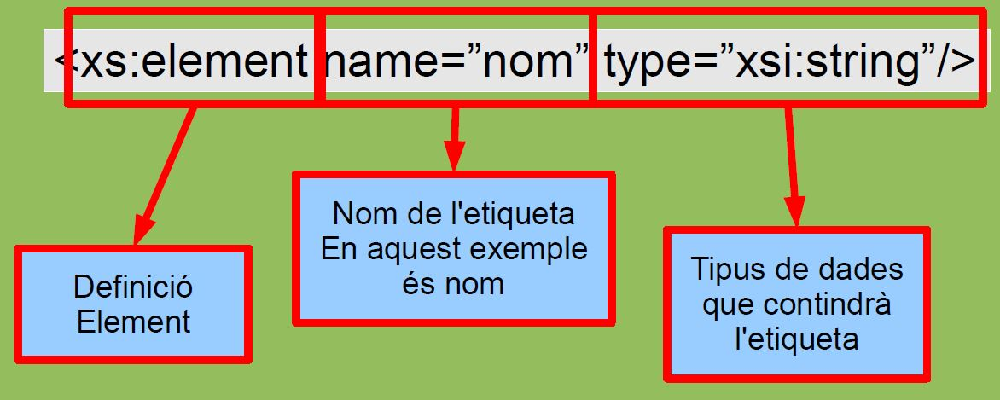
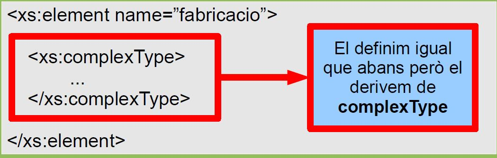
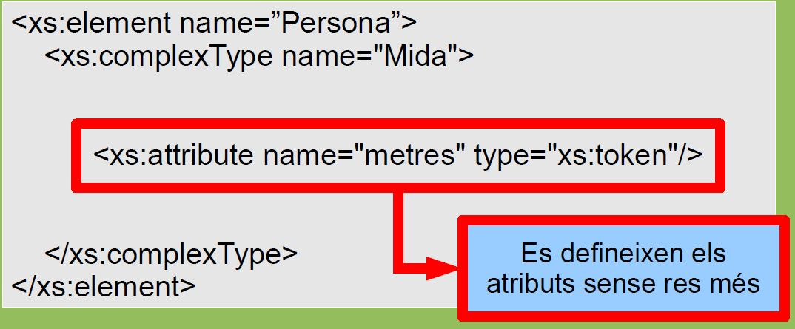

# Validació XML amb XSD

## Què és l'XSD?

> L'**XSD** (**X**ML **S**chema **D**efinition Language) és una manera més completa de crear validadors per l'XML.

L'objectiu dels XSD és acabar substituint completament als DTD degut a les limitacions que tenen aquests darrers.

**Avantatges:**

- Està escrit en XML i per tant ja en coneixem les regles.

- Dóna més control sobre el contingut d'un document XML ja que permet definir la **quantitat exacta d'elements fills** d'un element.

Actualment es troba en la **versió 1.1** (des del 2012) i se'n poden trobar les definicions a la pàgina <http://www.w3c.org/XML/Schema>

## Validació

La majoria dels validadors poden validar els XML Schemas.

Per exemple amb **xmllint** ho podem fer:

```bash
$ xmllint --noout --schema ./exercici.xsd exercici.xml
exercici.xml validates
```

També es pot fer amb **XML Copy Editor**, Sublime, Notepad++, etc.

## Associar l'esquema a un fitxer XML

> Per fer servir un Schema en el nostre document XML n'hem de definir el lloc on és.

L'especifiquem en l'element **arrel del document**.

```xml
<?xml version="1.0" encoding="UTF-8" ?>
<lliga xmlns:xsi="http://www.w3.org/2001/XMLSchema-instance" xsi:noNamespaceSchemaLocation="fitxer.xsd">
    <equip>FC Barcelona</equip>
    <equip>Real Madrid</equip>
</lliga>
```

El lloc on està el fitxer també pot ser una **URL**:

`xsi:SchemaLocation="http://www.lloc.com/fitxer.xsd"`

###En l'associació hi definim:

- On es defineix l'esquema dins de l'estàndard:

```xml
   xmlns:xsi="http://www.w3.org/2001/XMLSchema-instance"
```

- On hi ha físicament el fitxer:

```xml
   xsi:NamespaceSchemaLocation="fitxer.xsd"
```

Poden ser:

- `NamespaceSchemaLocation`: Defineix on està l'esquema si necessita espai de noms.
- `NoNamespaceSchemaLocation`: Defineix l'esquema quan no li fa falta cap espai de noms.

**Per exemple**, si tenim un document XML:

```xml
  <?xml version="1.0" encoding="UTF-8" ?>
  <classe>
     <curs>1r ASIX</curs>
     <professor>
         <nom>Pere Pi</nom>
     </professor>
  </classe>
```

Li **definirem on és el fitxer d'esquema** en l'etiqueta arrel:

```xml
  <?xml version="1.0" encoding="UTF-8"?>
  <classe xmlns:xsi="<http://www.w3.org/2001/XMLSchema-instance>"
     xsi:noNamespaceSchemaLocation="exercici.xsd">
```

## Definir un fitxer XML d'esquema

> La definició d'un fitxer d'esquema com que està en XML **ha de començar amb l'etiqueta d'XML**.

L'etiqueta `<schema>` és l'element arrel dels XML Schema:

```xml
<?xml version="1.0" encoding="UTF-8" ?>
<xs:schema xmlns:xs="http://www.w3.org/2001/XMLSchema">
    ...
</xs:schema>
```

> Com que és XML la etiqueta s'ha de tancar!

### Comentaris

Com que es tracta d'un document XML hi podem posar **comentaris** del tipus:

```xml
<!-- Comentari -->
```

Però també podem fer servir una forma normalitzada de posar-hi informació:

```xml
<xs:annotation>
    <xs:documentation>
        Aquest esquema XML està pensat per fer proves. Però aquí hi podria posar qualsevol cosa.
    </xs:documentation>
</xs:annotation>
```

## XML Schemas

En XSD tenim diferents tipus d'**etiquetes possibles**:

- Elements de **tipus simples**: Només contenen text
- Elements de **tipus complexos**: Podem contenir text, altres etiquetes o res.

> Sempre tindrem com a mínim un tipus complexe (l'arrel del document).

## Tipus simples

En Schema un element definit com a **simple** només conté text.

- No té ni atributs.
- No té etiquetes filles.



Utilitzant els **tipus de dades** podem controlar quin és el contingut de les etiquetes.

**Exemple per:**

**XSD**

```xml
<xs:element name="nom" type="xs:string" />
<xs:element name="any" type="xs:integer"/>
```

- En la definició de l'element es pot veure que definim quin **tipus de dades** conté l'element.

**XML**

```xml
<nom>Xavier</nom>
<any>2020</any>
```

### Tipus de dades

Els tipus de dades principals són:

| Tipus          | Explicació                                        |
| -------------- | ------------------------------------------------- |
| **xs:string**  | Contindrà una cadena de caràcters                 |
| **xs:decimal** | Contindrà un número                               |
| **xs:boolean** | Contindrà 'true' o 'false' o (1 o 0)              |
| **xs:date**    | Contindrà una data (AAAA-MM-DD)                   |
| **xs:anyURI**  | Contindrà una referència a un lloc (URL, disc...) |

- Podem trobat tots els tipus bàsics existents a <http://www.w3.org/TR/xmlschema-0/#CreatDt>

**Variants de tipus de dades**

Els tipus de dades generalment tenen diverses **variants** per adaptar-se millor a les dades que han de representar:

| Tipus       | Variants                                                                                                                                                            |
| ----------- | ------------------------------------------------------------------------------------------------------------------------------------------------------------------- |
| **Text**    | string, normalizedString, token, Name, NMTOKEN, ...                                                                                                                 |
| **Números** | integer, positiveInteger, negativeInteger, nonNegativeInteger, nonPositiveInteger, long, unsignedLong, int, unsignedInt, byte, unsignedByte, decimal, float, double |
| **Dates**   | duration, dateTime, date, time, gYear, gMonth, gYearMonth, gDay, gMonthDay                                                                                          |

**Exemples**

| XSD                                              | XML                                         |
| ------------------------------------------------ | ------------------------------------------- |
| `<xs:element name="dia" type="xs:date" />`       | `<dia>2020-09-15</dia>`                     |
| `<xs:element name="mes" type="xs:gMonth" />`     | `<mes>--3</mes>`                            |
| `<xs:element name="altura" type="xs:integer" />` | `<altura>220</altura>`                      |
| `<xs:element name="nom" type="xs:string" />`     | `<nom>Pere</nom>`                           |
| `<xs:element name="lloc" type="xs:anyURI" />`    | `<lloc>http://www.iescendrassos.net</lloc>` |

### Altres atributs

Els elements simples també poden tenir **altres atributs** que ens permetran definir-hi aspectes com:

- Valors fixes: **"fixed"**
- Valors per defecte: **"default"**
- Número de vegades que pot sortir una etiqueta: **"maxOccurs"**, **"minOccur"**
- Restringir els valors: **"restriction"**
- Definir patrons que han de complir el contingut
- Llistes de valors
- Unions

#### Valors fixes

> Podem definir que un element té un **valor fixe** definint-lo amb l'etiqueta **'fixed'**

```xml
<xs:element name="cap" type="xs:string" fixed="Manel" />
```

Això ens permet definir:

```xml
<cap>Manel</cap>
```

Però no:

```xml
<cap></cap>
<cap>Pere</cap>
```

#### Valors predefinits

> Podem definir que un element té un **valor predefinit** definint-lo amb l'etiqueta **'default'**

```xml
<xs:element name="cap" type="xs:string" default="Manel" />
```

Això ens permet definir:

```xml
<cap>Manel</cap>
<cap></cap>
<cap>Xavier</cap>
```

#### Ocurrències

> També es pot definir el **nombre de vegades** que ha de sortir l'element el document XML.

Podem definir el nombre **mínim** de vegades que ha d'aparèixer:

```xml
<xs:element name="cap" type="xs:string" minOccurs="1" />
```

- Si té un valor de 0 és que no té mínim.

També es pot definir el **màxim**:

```xml
<xs:element name="cap" type="xs:string" maxOccurs="3" />
```

**'unbounded'** implica un número indeterminat de vegades.

```xml
 <xs:element name="cap" maxOccurs="unbounded">
```

#### Restriccions

> Podem definir **restriccions** als tipus simples perquè s'adaptin a allò que ens interessa.

Definim el tipus amb `xs:simpleType` i el restringim amb `xs:restriction`

```xml
<xs:element name="naixement">
    <xs:simpleType>
        <xs:restriction base="xs:integer">
            <xs:maxInclusive value="2010" />
            <xs:minInclusive value="1850" />
        </xs:restriction>
    </xs:simpleType>
</xs:element>
```

##### Definir tipus

> Si hi ha alguna restricció que farem servir més vegades podem **definir un tipus amb nom**.

```xml
<xs:simpleType name="possible_naixement">
        <xs:restriction base="xs:integer">
            <xs:maxInclusive value="2010" />
            <xs:minInclusive value="1850" />
        </xs:restriction>
</xs:simpleType>
```

Que podrem usar en la definició de l'element:

```xml
<xs:element name="vida" type="possible_naixement" />
```

##### Tipus de restriccions

Hi ha molts atributs per definir restriccions:


##### Patrons

Els patrons són un avenç força important amb respecte als **DTD**.

Els patrons els podem definir amb:


**Per exemple** podem fer que el contingut d'un camp tingui forma d'un DNI:

```xml
<xs:element name="dni">
    <xs:simpleType>
        <xs:restriction base="xs:string">
            <xs:pattern value="[0-9]{8}[A-Z]" />
        </xs:restriction>
    </xs:simpleType>
</xs:element>
```

que validaria correctament:

```xml
<home>
    <dni>77980433K</dni>
</home>
```

#### Llistes

> Si volem que el contingut sigui una llista de valors ho podem definir amb `xs:list`

```xml
<xs:element name="partits">
    <xs:simpleType>
        <xs:list itemType="xs:dateTime" />
    </xs:simpleType>
</xs:element>
```

De manera que podrem definir coses com:

```xml
<partits>
    2019-09-12T17:30
    2019-09-19T19:00
</partits>
```

#### Unions

També podem fer que el valor de l'element sigui el resultat d'un tipus o d'un altre.

```xml
<xs:element name="valor">
    <xs:simpleType>
        <xs:union memberTypes="euros dolars" />
    </xs:simpleType>
</xs:element>
```

El valor haurà de ser un valor dels tipus "euros" o de "dolars"

> S'han de posar tipus obligatòriament

## Tipus complexes

> Un **tipus complexe** és un element XML que conté elements fills, atributs o una combinació d'ambdós.

Sempre hi haurà com a mínim un tipus complexe en els documents: l'arrel del document.

<!--
Podem dividir els tipus complexes en:

- Els que tenen contingut simple (SimpleType)
- Els que tenen contingut complexe (ComplexType)
-->

Hi ha 4 grans grups de tipus complexes:

1. **element buit**: Pot contenir atributs (els tipus simples han de contenir text i aquest no en té)
   - Per exemple: `<producte id="123"/>`
2. **només text**: Conté text i atributs
   - Per exemple: `<food type="dessert">Ice cream</food>`
3. **només elements**: Conté altres elements
4. **contingut mixt**: Pot tenir text, atributs i elements.

Els tipus complexes es desglossen en altres tipus complexes o en tipus simples.

### Definició de tipus complexes

No hi ha tipus complexes predefinits: els hem de definir nosaltres:



---

## ComplexType

El **_complexType_** és la base del contingut complexe i el podrem modificar fent servir diferents modificadors:

- **simpleContent**: Permet definir restriccions o extensions a continguts de només text

- **complexContent**: Permet afegir restriccions o extensions d'un tipus complexe

- **sequence**: Defineix seqüències d'etiquetes

- **all**: Permet especificar etiquetes que poden sortir en qualsevol ordre

- **choice**: Permet només un dels elements de dintre del tipus

<!--
 Tipus complexes només text (no els treballarem)


 Tipus només elements (no el treballarem)


-->

### Seqüències de fills

> Seqüències d'elements `<xs:sequence>` en un ordre determinat.

```xml
<xs:complexType nom="persona">
    <xs:sequence>
        <xs:element name="nom" type="xs:string"/>
        <xs:element name="cognom" type="xs:string" maxOccurs="2"/>
    </xs:sequence>
</xs:complexType>
```

- Es defineixen **en l'ordre** en el que els volem.
- Pot contenir altres seqüències ...

### Fills en qualsevol ordre

> Quan ens interessi que els elements apareguin en qualsevol ordre fem servir `<xs:all>`

```xml
<xs:complexType nom="persona">
    <xs:all>
        <xs:element name="nom" type="xs:string"/>
        <xs:element name="cognom" type="xs:string"/>
    </xs:all>
</xs:complexType>
```

- Només pot contenir elements.
- Les etiquetes dins de `all` **només poden sortir UN COP**.


Una solució alternativa pot ser crear un tipus complexe amb la repetició


### Seleccions

> Podem definir o bé uns elements o bé uns altres `<xs:choice>`

```xml
<xs:complexType nom="persona">
    <xs:choice>
        <xs:element name="nomCognom" type="xs:string"/>
        <xs:element name="dni"  type="xs:string"/>
    </xs:choice>
</xs:complexType>
```

### Determinisme

S'ha de tenir en compte que davant de cada decisió el processador ha de saber per quin camí ha de tirar.

No es poden fer coses com:

```xml
<xs:choice>
    <xs:sequence>
        <xs:element name="nom"/>
        <xs:element name="alies"/>
        <xs:element name="cognom"/>
    </xs:sequence>
    <xs:sequence>
        <xs:element name="nom"/>
        <xs:element name="cognom"/>
    </xs:sequence>
</xs:choice>
```

### Referències a elements

Podem definir els elements de forma global i després usar-los en les definicions de tipus

```xml
<xs:element name="nom" type="xs:string" />
<xs:element name="cognom" type="xs:string" />
<xs:element name="persona">
    <xs:complexType>
        <xs:element ref="nom" />
        <xs:element ref="cognom" />
    </xs:complexType>
</xs:element>
```

Això ens permetrà reutilitzar-los quan ens facin falta.

### Tipus complexes buits



<!--
- Si no té atributs podem definir (no ho treballarem)

```xml
<xs:complexContent>
    <xs:restriction base="xs:anyType"/>
</xs:complexContent>
```
-->

**Si no té atributs** també podria haver definit la etiqueta amb el **tipus simple**.

Definint-ne la llargada a zero.

```xml
<xs:element name="delegat">
    <xs:simpleType>
        <xs:restriction base="xs:string">
            <xs:length value="0"/>
        </xs:restriction>
    </xs:simpleType>
</xs:element>
```

---

### Grups d'elements

> Si un grup d'elements surten varies vegades podem definir un **grup**.

```xml
<xs:group name="moneder">
        ...
</xs:group>
<xs:group ref="moneder" />
```

> S'han de definir al principi del fitxer.

## Atributs

> Els **atributs** són elements simples que sempre estan dins de tipus complexes.

```xml
<xs:attribute name="Id" type="xs:string" />
```

S'hi pot treballar igual que amb els elements:

```xml
<xs:attribute name="Id">
        <xs:simpleType>
            <xs:restriction base="xs:integer" />
                <xs:pattern value="\d{4}" />
            </xs:restriction>
        </xs:simpleType>
</xs:attribute>
```

### Atributs: use

- A menys que es digui el contrari els atributs sempre són opcionals
- Per fer-lo necessari hem de definir-lo amb **use="required"**

```xml
<xs:attribute name="src" type="xs:anyURI" use="required" />
```

- Perquè no es faci servir posem **use="prohibited"**
- També existeix la opció **use="optional"** però realment és el comportament per defecte
- Com amb les etiquetes podem definir valors per defecte, valors fixes i grups d'atributs

```xml
<xs:attribute name="numero" type="xs:integer" default="1" />
<xs:attribute name="especial" type="xs:integer" fixed="Disabled" />
<xs:attributeGroup name="Persones">
...
</xs:attributeGroup>
<xs:attributeGroup ref="Persones" />
```

- Per tant per definir els atributs d'aquest element:

```xml
<factura numero="24" empresa="Porquets, SA" />
```

```xml
<element name="factura">
    <xs:complexType>
        <xs:sequence>
            <xs:element ref="nom" maxOccurs="1" />
        </xs:sequence>
        <xs:attribute name="numero" type="xs:integer" use="required"/>
        <xs:attribute name="empresa" type="xs:string" />
    </xs:complexType>
</element>
```
