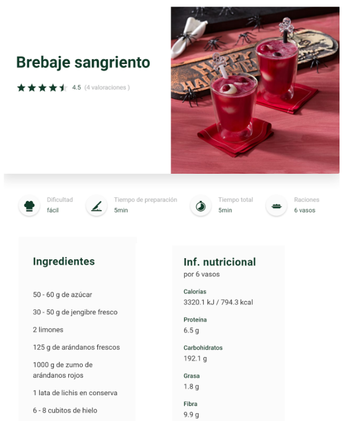
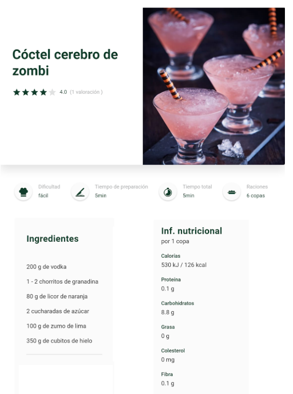

# XML

> **XML** (_Extensible Markup Language_) és un llenguatge de marques dissenyat per emmagatzemar i transportar dades de manera estructurada.

Exemple bàsic d'un document XML:

```markup
<persona>
    <nom>
        Sergi
    </nom>
    <cognom>
        Coll
    </cognom>
</persona>
```

Una de les idees més importants és:

> Separar les dades de la presentació

- XML no es preocupa de com es presentaran les dades als usuaris
- Per fer la presentació ja s'han desenvolupat mecanismes:
  - **CSS**, **XSL-FO**, etc.

## Extensible

Un altre dels avantatges de XML és que es fàcilment **extensible i adaptable**:

> XML **no defineix un nombre limitat d'etiquetes**.

Podem crear les etiquetes (tags) que tinguin significat per nosaltres. Podem crear el vocabulari que ens faci falta per allò que busquem.

A més, hi ha formes de definir quina és l'**estructura** que volem que tinguin els document XMLs.

- Hi ha diversos estàndards _**DTD**_, _**XML Schema Language**_, _**Relax NG**_, etc..
- Ens serviran per comprovar que el document compleix amb les normes del vocabulari.

## Formats Estàndards

Tenim la capacitat de crear un vocabulari per representar dades d'un àmbit.

Ja hi ha vocabularis estàndards XML:

- **SVG**: Pensat per gràfics vectorials escalables 2D
- **MathML**: Representació de fórmules matemàtiques
- **CML**: Intercanvi d'informació química
- **SMIL**: Tractament de la informació multimèdia
- **SSML**: Síntesi de la veu

## Principals usos d'XML

XML s'està fent servir en múltiples camps:

- **Intercanvi de dades entre aplicacions**: Moltes aplicacions utilitzen XML per intercanviar dades en formats estructurats. Per exemple, els serveis web sovint usen XML per enviar respostes i sol·licituds.

- **Emmagatzematge de dades en documents**: Aplicacions com Microsoft Office o LibreOffice utilitzen XML per desar documents en formats com DOCX, XLSX o ODT, els quals són paquets ZIP amb fitxers XML a dins.

  **Exemple**: Part d’un document de text en format DOCX.

  ```xml
    <w:document>
      <w:body>
        <w:p>
          <w:r>
            <w:t>Hola món!</w:t>
          </w:r>
        </w:p>
      </w:body>
    </w:document>
  ```

- **Fitxers de configuració**: XML és utilitzat per guardar configuracions de programari o aplicacions, perquè permet una estructura clara i jeràrquica de les dades.

  **Exemple**: Un fitxer de configuració per a una aplicació web.

  ```xml
    <?xml version="1.0" encoding="UTF-8"?>
    <configuració>
      <baseDeDades>
        <servidor>localhost</servidor>
        <usuari>admin</usuari>
        <contrasenya>12345</contrasenya>
      </baseDeDades>
    </configuració>
  ```

- Molts dels **documents de configuració** dels sistemes operatius estan en XML:

  **Linux**

  ```bash
  $ locate .xml | wc -l
  21829
  ```

  **Windows**

  ```bash
  C:\> dir /a-d /s *.xml | find /c /v “”
  698
  ```

## Aplicacions on s’utilitza XML

- **Android**: Els fitxers de disseny d'interfícies d’usuari (UI) en Android estan escrits en XML.
- **Microsoft Office i OpenOffice**: Els documents (com DOCX, XLSX, ODT) estan basats en XML.
- **Servidors web**: Configuracions i respostes de serveis web sovint utilitzen XML.
- **Sistemes RSS**: Distribució de notícies i continguts d'un lloc web a través de canals RSS.

## Desavantatges de XML

- Els fitxers XML tendeixen a ocupar molt d'espai.
  - XML ocupa més espai a disc que els seus equivalents en format binari.
  - Lentitud en el temps de càrrega.
  - Temps de transferència més elevat.

Però això a vegades és compensat per:

- La facilitat d'interoperabilitat entre programes.
- El preu de l'emmagatzematge és baix.

---

# Creació documents XML

## Declaració de XML

Els documents XML han de començar amb la declaració que indiqui la versió i la codificació utilitzada en el document XML.

```markup
<?xml version="1.0" encoding="UTF-8" ?>
```

- **`version="1.0"`**: especifica que el document segueix l'estàndard XML 1.0.
- **`encoding="utf-8"`**: indica que la codificació de caràcters del document és UTF-8, una codificació que permet representar una gran varietat de caràcters internacionals.

Aquesta declaració és opcional, però recomanable per assegurar la correcta interpretació del document. Es posa a la primera línia del document:

```xml
<?xml version="1.0" encoding="UTF-8"?>
<llibres>
  <llibre>
    <títol>El petit príncep</títol>
    <autor>Antoine de Saint-Exupéry</autor>
    <any>1943</any>
  </llibre>
</llibres>
```

## Regles bàsiques

### Tots els documents tenen una etiqueta arrel

### 1. Elements

Els elements en XML estan delimitats per etiquetes d'obertura i tancament, on l'etiqueta d'obertura és `<element>` i l'etiqueta de tancament és `</element>`. Un element pot contenir dades o altres elements.

**Exemple d'un element:**

```xml
<nom>Pit de pollastre</nom>
```

En aquest exemple, `nom` és l'element que conté el valor `Pit de pollastre`.

### 2. Etiqueta arrel

Tot document XML ha de tenir una **única** etiqueta arrel que contingui tots els altres elements del document.

L'**etiqueta arrel** és aquella que es defineix després de la declaració del document.

```markup
<persona>           <!-- Etiqueta arrel -->
  <nom>Pere Pi</nom>
  <nom>Marta Mata</nom>
</persona>          <!--Tancament etiqueta arrel -->
```

Aquest no seria un document XML correcte:

```markup
  <nom>Pere Pi</nom>
  <nom>Marta Mata</nom>
```

### 3. Totes les etiquetes s'han de tancar

```markup
<article>Pissarra</article>
```

No es poden fer coses com les que permet HTML:

```markup

```

Si tenim una etiqueta sense dades el podem representar amb el tancament `/>`:

```markup
<article nom="pissarra"/>
```

### 4. Les etiquetes han d'estar niades correctament

Cal tancar les etiquetes per l'ordre invers en què s'han obert.

**INCORRECTE**

```markup
<inventari>
  <article>
    Pissarra
  </inventari>
</article>
```

Les etiquetes estan tancades en ordre invers i per tant és incorrecte.

### 5. Les majúscules i minúscules són diferents

Per tant aquestes dues són etiquetes diferents:

```markup
<article>Pissarra</article>
<Article>Pissarra</Article>
```

**I això és incorrecte!**

```markup
<Article>Pissarra</article>
```

### 6. Atributs

Els elements poden tenir atributs que proporcionen informació addicional.

Els atributs es defineixen dins de l'etiqueta d'obertura i tenen el format clau-valor.

**Exemple d'un element amb atributs:**

```xml
<llibre idioma="català">El Petit Príncep</llibre>
```

En aquest exemple, `idioma` és un atribut amb el valor `català`, i l'element conté el text `El Petit Príncep`.

### Els valors dels atributs han d'estar entre cometes

Els valors dels **atributs** han d'estar entre **cometes** fins i tot si són números

I no importa si són cometes simples o dobles.

```markup
<article quantitat="3">Pissarra</article>
```

**I això és incorrecte:**

```markup
<article quantitat=3>Pissarra</article>
```

## Exercicis

### Exercici 1: Creació i validació d'un document XML

> **Objectiu**: Aprendre a estructurar informació en un document XML i validar que la sintàxi és correcte.

Es vol emmagatzemar informació sobre libres en un document xml. La informació a emmagatzemar és.

- Títol, ISBN i categoria
- Autor
- Any de publicació
- Gènere

Un exemple d'xml és aquest:

```xml
<llibreria>
  <llibre isbn="3423423432" categoria="aventures">
    <titol>El Petit Príncep</titol>
    <autor>Antoine de Saint-Exupéry</autor>
    <any>1943</any>
  </llibre>
  <llibre isbn="343432888" categoria="distopies">
    <titol>1984</titol>
    <autor>George Orwell</autor>
    <any>1949</any>
  </llibre>
</llibreria>
```

**Fes un document XML que serveixi per representar les dues receptes de cuina següents de manera que no es perdin dades.**

1. Comença amb la declaració XML adequada.
2. Crea una etiqueta arrel que contingui totes les receptes.
3. Per a cada recepta, crea un element que contingui els següents subelements:
   - Nom del plat
   - Ingredients (cada ingredient ha de ser un subelement)
   - Informació nutricional (calories, proteïnes, greixos, hidrats de carboni).
4. Pots utilitzar atributs per indicar la dificultat de la recepta (fàcil, mitjana, difícil), temps de preparació i el nombre de racions .

Desa el fitxer amb el nom `receptes.xml`

**Recepta 1**


**Recepta 2**


Comprova que el teu document té un format correcte, per exemple a [XMLValidation](https://www.xmlvalidation.com/)

> **Nota:** si veus que es correcte, prova errors per tal que sigui incorrecte i vegis com el validador t'avisa que no és correcte\*\*
